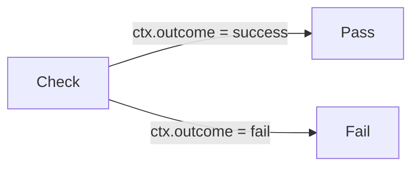
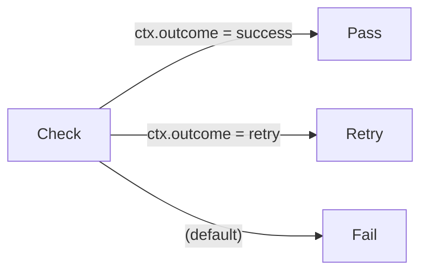
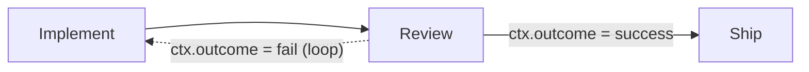
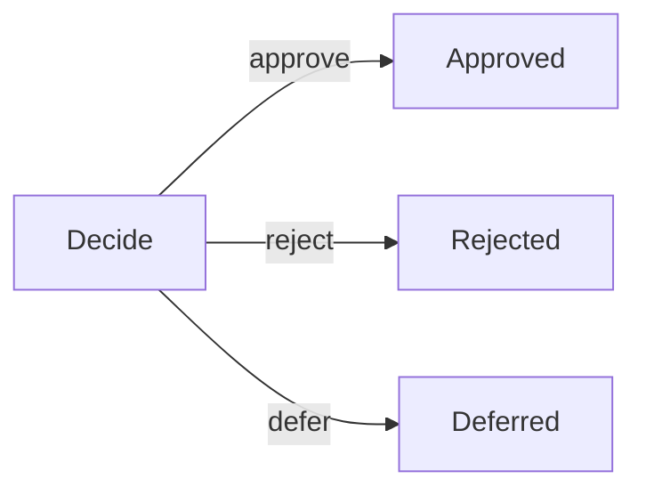
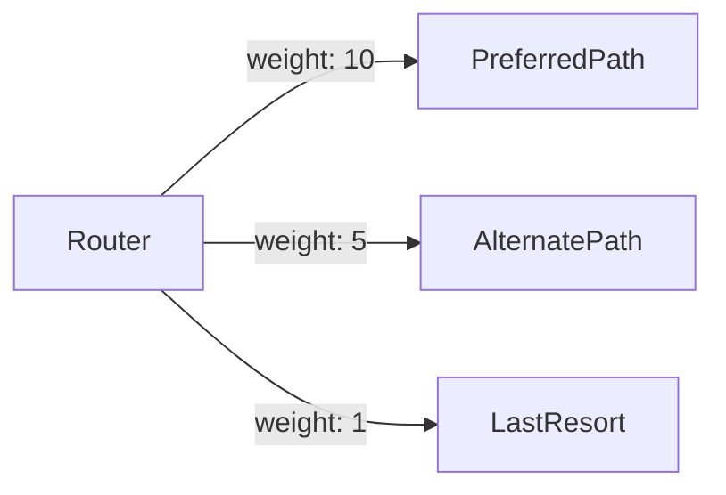

# Edge Reference

Edges define the connections between nodes in a Dippin workflow. They control the flow of execution — which node runs after which, under what conditions, and with what priority.

---

## Format Version Declaration

A `.dip` file may declare its format version on the first line:

```dippin
dip 2

workflow Example
  ...
```

The declaration is `dip` followed by an integer. A file with **no** declaration defaults to version **1**. The formatter only emits the `dip N` line when the version is greater than 1, so existing v1 files round-trip byte-for-byte unchanged and never gain a declaration.

The version is parsed before the workflow body, which lets later format versions change edge syntax wholesale. `dippin fmt --migrate` re-emits a file in its current format version; today it is a no-op identity pass for already-current files. (v1→v2 edge transforms land in a later release.)

---

## Edge Syntax

All edges are defined in the `edges` block at the bottom of a workflow:

```dippin
  edges
    A -> B
    B -> C when ctx.outcome = success
    B -> D when ctx.outcome = fail label: "retry" loop
```

Each edge is a single line:

```
<FromID> -> <ToID> [on <token> | when <condition>] [label: <text>] [weight: <int>] [loop] [override: true]
```

---

## Edge Fields

| Field | Type | Required | Description |
|-------|------|----------|-------------|
| `From` | Node ID | Yes | Source node — where the edge originates |
| `To` | Node ID | Yes | Target node — where the edge leads |
| `on` | Token | No | Shorthand for an equality guard against the source node's outcome channel — agent (`ctx.outcome`) or tool+`marker_grep` (`ctx.tool_marker`) (see [Outcome Shorthand](#outcome-shorthand-on)). |
| `when` | Condition | No | Boolean guard expression. Edge is only traversed if true at runtime. |
| `label` | String | No | Human-readable text. Displayed on the edge in DOT exports. Also used for human gate choice matching. |
| `weight` | Integer | No | Priority hint. Higher values win when multiple edges are candidates. |
| `loop` | Flag | No | Bare keyword marking this as a back-edge that triggers a loop restart. The legacy `restart: true` is an accepted synonym that `dippin fmt` rewrites to `loop`. |
| `override` | Boolean | No | Carried, not interpreted by dippin. Marks an edge as a human-authored validation override for a paired runtime to act on (e.g. tracker's `validation_overridden` flow); dippin does not assign it any execution semantics. |

---

## Edge Types

### Unconditional Edges

An edge with no `when` clause is always available:

```dippin
    Start -> Process
    Process -> Done
```

### Conditional Edges

Edges gated on runtime conditions:

```dippin
    Review -> Approve  when ctx.outcome = success
    Review -> Reject   when ctx.outcome = fail
```

At runtime, the engine evaluates conditions and follows the first matching edge. If no conditional edge matches and there's an unconditional edge, that serves as the fallback.

### Outcome Shorthand (`on`)

The most common condition is an equality test against the source node's *natural outcome channel*. `on <token>` is shorthand for exactly that:

```dippin
    Review -> Approve  on success      # = when ctx.outcome = success
    Review -> Reject   on fail         # = when ctx.outcome = fail
    Tests  -> Ship     on tests_green  # = when ctx.tool_marker = tests_green
```

The channel is chosen from the source node's kind:

- **agent** nodes → `ctx.outcome`
- **tool** nodes that declare `marker_grep` → `ctx.tool_marker`

`on` is pure sugar: it produces the identical condition to the equivalent `when`, is non-breaking, and `dippin fmt` rewrites eligible `when` edges into `on` form. Any source node without a defined outcome channel has no `on` channel — use `when` there. This includes **human gates** (they route on the human's choice / edge labels, not `ctx.outcome`; dedicated routing keys arrive with `choice:`), `conditional` nodes, and tools without `marker_grep`. Use `when` for everything that isn't a single equality (`and`/`or`, `contains`, dotted vars, `!=`, etc.).

### Labeled Edges

Labels serve dual purpose — display text and human gate routing:

```dippin
    # Display label in DOT visualization:
    Validate -> Fix label: "needs work"

    # Human gate choices (label determines which edge the choice follows):
    Approve -> Ship    label: "yes"
    Approve -> Revise  label: "no"
```

### Weighted Edges

Weight provides a priority hint when multiple edges compete:

```dippin
    Router -> PathA weight: 10
    Router -> PathB weight: 5
    Router -> PathC weight: 1
```

Higher weight = higher priority. If conditions and labels don't resolve the choice, weight breaks the tie.

### Loop Edges (Back-Edges)

A `loop` edge creates a controlled back-edge. `loop` is a bare keyword — the heaviest-semantics construct in the language gets a scannable word rather than a boolean flag buried among attributes:

```dippin
    Validate -> Implement when ctx.outcome = fail loop
```

`loop` sets the same back-edge field as the legacy `restart: true`, which still parses; `dippin fmt` rewrites `restart: true` to `loop`. Because `loop` is a reserved bare keyword, an unquoted `loop` on a condition's right-hand side is taken as the flag — write `when ctx.x = "loop"` (quoted) for the literal value.

When a loop edge is followed:

1. The engine increments the global restart counter
2. If the counter exceeds `max_restarts` (default 5), the pipeline fails
3. The engine clears all nodes downstream of the target from the completed set
4. Retry counts for cleared nodes are reset (fresh budgets)
5. Context is **preserved** — all key-values survive across restarts
6. Execution resumes from the restart target node

Loop edges are **not** counted as cycles by DIP005 validation — they are the intentional mechanism for iteration.

In DOT export, loop edges are styled with dashed lines.

---

## Routing Priority

When a node completes, the engine selects the next edge using this cascade (first match wins):

| Priority | Mechanism | Description |
|----------|-----------|-------------|
| 1 | **Condition match** | First edge whose `when` condition evaluates to true |
| 2 | **Handler preference** | Edge whose label matches the node's `PreferredLabel` from its outcome |
| 3 | **Handler suggestion** | Edge leading to a node in the handler's `SuggestedNextNodes` |
| 4 | **Weight** | Highest `weight` value among remaining edges |
| 5 | **Lexical** | Alphabetically first by target node ID |

This means conditions always take precedence over labels, and labels over weights. The lexical fallback ensures deterministic behavior.

---

## Failure Handling

A node enters the failure cascade when it errors, fails a `goal_gate`, **exhausts
`max_turns`**, or trips the graph **`stall_timeout`**. All route through the same
priority order below.

When an agent node finishes with outcome `fail` or errors, the runtime resolves a failure route using the following precedence (first match wins):

| Priority | Mechanism | Description |
|----------|-----------|-------------|
| 1 | **Explicit fail edge** | An outgoing edge with `when ctx.outcome = fail` (or `failure`) on the node |
| 2 | **Bounded node retry** | `retry_target` + `max_retries` — node retries before propagating failure |
| 3 | **Node fallback_target** | The node's own `fallback_target` field — used when retries are exhausted |
| 4 | **Graph on_failure** | The workflow's `defaults.on_failure` node ID — catch-all for any agent without a more specific route |
| 5 | **Halt** | No route found — the pipeline stops |

Graph-level `on_failure` is declared in the `defaults` block — it is a workflow-wide fallback target, not a per-node field:

```dippin
  defaults
    on_failure: Escalate
```

A loop edge (`loop`) tagged with `when ctx.outcome = fail` falls under priority 1 and carries its own `max_restarts` budget rather than `max_retries`.

**Separation of concerns:** dippin validates that the `on_failure` target node exists (DIP003) and is reachable (DIP004); the runtime owns the evaluation ordering shown above. DIP144 warns when an agent node has no failure route at any level of this cascade; any of priorities 1–4 suppresses the warning.

---

## Condition Expressions

### Comparison Operators

All operators perform string comparison — there is no numeric coercion.

| Operator | Meaning | Example |
|----------|---------|---------|
| `=`, `==` | Exact string equality | `ctx.outcome = success` |
| `!=` | String inequality | `ctx.outcome != fail` |
| `contains` | Substring match | `ctx.response contains "approved"` |
| `not contains` | Negated substring | `ctx.tool_stdout not contains all-done` |
| `startswith` | Prefix match | `ctx.response startswith "ERROR"` |
| `endswith` | Suffix match | `ctx.filename endswith ".go"` |
| `in` | Value in comma-separated list | `ctx.status in "pass,fail,skip"` |

Infix `not` can negate any operator: `var not contains val` is equivalent to `not var contains val`.

### Logical Operators

| Operator | Meaning | Precedence |
|----------|---------|------------|
| `not` | Logical negation | Highest |
| `and` | Logical AND | Medium |
| `or` | Logical OR | Lowest |

Use parentheses to override precedence:

```dippin
    # Without parens: "not A and B" means "(not A) and B"
    A -> B when not ctx.outcome = fail and ctx.score = high

    # With parens: explicit grouping
    A -> B when (ctx.x = 1 or ctx.y = 2) and ctx.z = 3
```

### Condition AST

Internally, conditions are parsed into an AST (not evaluated as strings). The AST types are:

- `CondCompare` — A single comparison (`variable op value`)
- `CondAnd` — Logical AND of two sub-expressions
- `CondOr` — Logical OR of two sub-expressions
- `CondNot` — Logical negation of a sub-expression

This means typos in variable names can be caught at lint time (DIP106) rather than silently evaluating to empty string.

---

## Context Variables in Conditions

All variables use explicit namespaces. See [context.md](context.md) for the full reference.

Common variables used in conditions:

| Variable | Set By | Values |
|----------|--------|--------|
| `ctx.outcome` | Agent (auto_status), engine | `"success"`, `"fail"`, `"retry"` |
| `ctx.tool_stdout` | Tool nodes | Command's stdout output |
| `ctx.tool_stderr` | Tool nodes | Command's stderr output |
| `ctx.tool_marker` | Tool nodes | Tool stdout regex match (when `marker_grep` is declared on the source tool node) |
| `ctx.tool_route` | Tool nodes | A routing value the runtime extracts from the tool's stdout — populated when the tool emits a routing sentinel the runtime recognizes (format defined by the runtime); `route_required: true` additionally fails the node if none is emitted |
| `ctx.human_response` | Human nodes | User's text input |
| `ctx.last_response` | Agent nodes | LLM's response text |
| `graph.goal` | Workflow header | The workflow's goal string |

---

## Routing Patterns

### Binary branch



```dippin
  edges
    Check -> Pass when ctx.outcome = success
    Check -> Fail when ctx.outcome = fail
```

### Branch with fallback

Always include an unconditional edge as a fallback (avoids DIP102 warning):



```dippin
  edges
    Check -> Pass    when ctx.outcome = success
    Check -> Retry   when ctx.outcome = retry
    Check -> Fail    # unconditional fallback
```

### Retry loop



```dippin
  edges
    Implement -> Review
    Review -> Ship       when ctx.outcome = success
    Review -> Implement  when ctx.outcome = fail loop
```

### Human choice gate



```dippin
  human Decide
    mode: choice
    default: "approve"

  edges
    Decide -> Approved label: "approve"
    Decide -> Rejected label: "reject"
    Decide -> Deferred label: "defer"
```

### Weighted fallback



```dippin
  edges
    Router -> PreferredPath weight: 10
    Router -> AlternatePath weight: 5
    Router -> LastResort    weight: 1
```

---

## Validation Rules for Edges

| Code | Rule | Severity |
|------|------|----------|
| DIP003 | Edge endpoints or on_failure target must reference an existing node | Error |
| DIP004 | All nodes (including the on_failure target) must be reachable from start | Error |
| DIP005 | No unconditional cycles (loop edges are exempt) | Error |
| DIP006 | Exit node must have zero outgoing edges | Error |
| DIP009 | No duplicate edges (same from, to, and condition) | Error |
| DIP101 | Node only reachable via conditional edges may be skipped | Warning |
| DIP102 | Node with conditional outgoing edges has no unconditional fallback | Warning |
| DIP103 | Multiple edges from same node test same variable=value | Warning |
| DIP105 | No guaranteed path from start to exit | Warning |
| DIP144 | Agent node has no failure route (no fail edge, no fallback_target, no bounded retry, no graph on_failure) | Warning |

See [validation.md](validation.md) for full details on each code.
