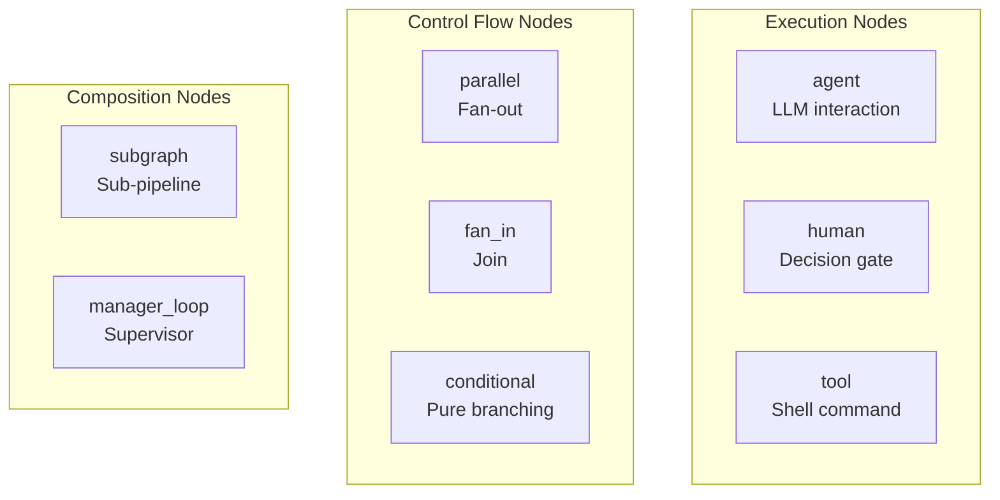
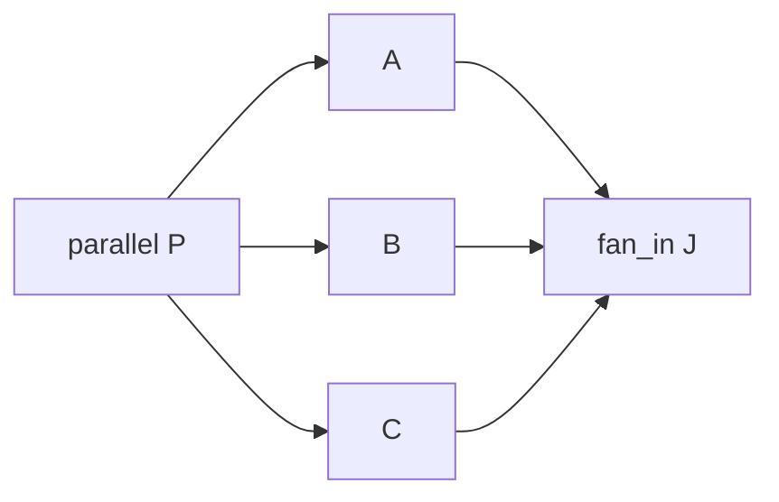

# Node Reference

Nodes are the building blocks of a Dippin workflow. Each node represents a single step in the pipeline — an LLM call, a human decision, a shell command, or a control-flow construct.

See also: [docs/syntax.md](syntax.md) — Workflow Header (`goal`, `requires`, `start`, `exit`).

---

## Node Kinds

There are 8 node kinds, each with its own syntax and configuration:



| Kind | Purpose | Syntax |
|------|---------|--------|
| `agent` | LLM interaction | Block with prompt |
| `human` | Human decision gate | Block with mode |
| `tool` | Shell command execution | Block with command |
| `parallel` | Fan-out to concurrent branches | Inline declaration |
| `fan_in` | Join concurrent branches | Inline declaration |
| `conditional` | Pure branching (no LLM call) | Block with label |
| `subgraph` | Embed a sub-pipeline | Block with ref |
| `manager_loop` | Supervise a child subgraph | Block with subgraph_ref |

---

## Common Fields

These fields are available on **all** block-style node kinds (agent, human, tool, subgraph):

| Field | Type | Required | Description |
|-------|------|----------|-------------|
| `label` | String | No | Human-readable display name. Shown in DOT exports and UI. Defaults to the node ID if omitted. |
| `class` | CSV | No | Comma-separated stylesheet class names for theming (reserved for post-v1). |
| `reads` | CSV | No | Context keys this node expects to read. Advisory — used for linting (DIP112), not enforced at runtime. |
| `writes` | CSV | No | Context keys this node will produce. Advisory — used for linting (DIP107), not enforced at runtime. |
| `retry_policy` | String | No | Named retry strategy: `"standard"`, `"aggressive"`, `"patient"`, `"linear"`, `"none"`. Overrides the workflow default. |
| `max_retries` | Integer | No | Maximum retry attempts before giving up. Overrides the workflow default. |
| `base_delay` | Duration | No | Override the retry policy's default base delay (e.g. `500ms`, `2s`, `1m`). |
| `retry_target` | String | No | Node ID to jump to when retrying. This is the **retry channel** the engine reads from the node — not an edge. Spelled `retry_target` in both `dip 1` and `dip 2`. |
| `fallback_target` / `fallback_retry_target` | String | No | Node ID to route to when all retries are exhausted (the retry-exhaustion route the engine reads from the node — not an edge). Spelled `fallback_target` in `dip 1`, `fallback_retry_target` in `dip 2`; `dippin fmt --migrate` relabels it. A graph-level catch-all can also be declared via `defaults.on_failure` (see [edges.md](edges.md) — Failure Handling). |

### reads and writes

These are **advisory I/O declarations**. They tell the linter what context keys a node expects and produces, enabling checks like:

- **DIP112**: A node declares `reads: plan` but no upstream node declares `writes: plan`
- **DIP107**: A node declares `writes: summary` but no downstream node reads it

Use bare key names (not namespaced): `reads: human_response`, not `reads: ctx.human_response`.

```dippin
  agent Interpret
    reads: human_response
    writes: plan, summary
    prompt:
      Based on the user's response, create a plan.
```

---

## Agent Nodes

Agent nodes invoke an LLM. They are the most configurable node kind.

```dippin
  agent Analyze
    label: "Analyze the request"
    model: claude-opus-4-6
    provider: anthropic
    max_turns: 3
    reasoning_effort: high
    goal_gate: true
    auto_status: true
    reads: human_response
    writes: analysis
    prompt:
      You are a senior software architect.
      Analyze the following request carefully.

      ## User Request
      ${ctx.human_response}
    system_prompt:
      Always respond in structured markdown.
```

### Agent-Specific Fields

| Field | Type | Default | Description |
|-------|------|---------|-------------|
| `prompt` | Multiline | — | The main prompt sent to the LLM. This is the primary instruction for what the agent should do. Supports context variable interpolation with `${ctx.key}` syntax. |
| `prompt_file` | String | — | Path (relative to .dip dir) to an external file whose contents become the agent's `prompt`. Mutually exclusive with `prompt:`. |
| `system_prompt` | Multiline | — | System-level instructions passed separately to the LLM. Has higher behavioral precedence than the user prompt. Used for persistent rules like output format or persona. |
| `system_prompt_file` | String | — | Path (relative to .dip dir) to an external file whose contents become the agent's `system_prompt`. Mutually exclusive with `system_prompt:`. |
| `prompt_include` | String | — | Path (relative to .dip dir) to a fragment file appended after this agent's body, before the defaults cascade suffix (#175). Composed into `prompt` at resolve time. |
| `prompt_prefix` | `none` | inherit | Set to `none` to opt this agent out of the `defaults` prompt-prefix cascade (#175). Only `none` is valid at node level. |
| `prompt_suffix` | `none` | inherit | Set to `none` to opt this agent out of the `defaults` prompt-suffix cascade (#175). Only `none` is valid at node level. |
| `model` | String | workflow default | LLM model identifier (e.g., `"claude-opus-4-6"`, `"gpt-5.4"`). Overrides the workflow-level default. |
| `provider` | String | workflow default | LLM provider (e.g., `"anthropic"`, `"openai"`, `"gemini"`). Overrides the workflow-level default. |
| `backend` | String | runtime default | Per-node backend override (e.g., `native`, `claude-code`, `acp`). |
| `working_dir` | String | — | Per-node working directory override for isolated execution. |
| `tool_access` | String | — (full catalog) | LLM tool-catalog gate. Set to `none` to strip the model's tool registry on this agent. Bounds the v0.28.2 single-agent multi-tool-call vector (DIP139 warns on unknown values; runtime fail-closes). |
| `writable_paths` | CSV (globs) | — (unbounded) | Comma-separated glob list bounding where this agent's tools may write (e.g. `workspace/**, .ai/sprints/**`), resolved against the session root. Absent = unbounded. A present-but-empty `writable_paths:` is rejected by `dippin validate`/`pack` (parse error — list at least one glob or omit the field). Malformed values fail **closed** at the runtime (deny-all / refuse-to-start). Enforced on the **native backend** only; `claude-code`/`acp` refuse to start. No brace-expansion globs: `writable_paths` is comma-split, so `*.{md,yaml}` is torn into `*.{md` and `yaml}` — enumerate entries instead (DIP142). Distinct from `writes:` (advisory context keys produced) — `writable_paths:` bounds enforced file-write paths. Enforced by the runtime (not by dippin). |
| `max_turns` | Integer | 1 | Maximum request-response cycles in the agent's tool-using loop. **Reaching this limit ends the node with outcome `fail`** — it is a hard cap, not a soft budget. The failure routes through the standard failure cascade (fail edge → bounded retry → `fallback_target` → graph `on_failure` → halt). Ensure a failure route exists (see DIP144) or the run halts on exhaustion. |
| `cmd_timeout` | Duration | — | Command execution timeout for the agent's agentic loop (e.g., `30s`, `5m`). Applies to tool/command calls made within the agent, not to the LLM API call itself. |
| `cache_tools` | Boolean | workflow default | Whether to cache tool call results for this agent. Useful for expensive, deterministic tools. |
| `compaction` | String | workflow default | Context compaction mode for managing long context windows. |
| `compaction_threshold` | Float | — | Threshold value that triggers compaction (provider-specific semantics). |
| `last_response_truncate` | Integer | — | Caps how much of the prior node's response is carried into this agent's context, in characters. `0`/unset = no truncation. Bounds the context-chaining attack surface; a negative value raises DIP148. |
| `reasoning_effort` | String | — | Extended thinking effort level (provider-specific, e.g., `"none"`, `"minimal"`, `"low"`, `"medium"`, `"high"`, `"xhigh"`, `"max"`). Controls how much reasoning budget the LLM spends. |
| `fidelity` | String | workflow default | Checkpoint fidelity level for this node's state. |
| `auto_status` | Boolean | false | When true, the engine parses `STATUS: <status>` from the LLM response to set `ctx.outcome`. This enables automatic routing based on the agent's self-assessment. |
| `goal_gate` | Boolean | false | When true, this node is a "goal gate" — if it fails (outcome != success), the entire pipeline fails even if execution reaches the exit node. Used for critical quality checks. |
| `response_format` | String | — | Forces structured JSON output. Values: `json_object` (force valid JSON, any shape), `json_schema` (force JSON matching the schema in `response_schema`). Agent-only. Triggers DIP130 if an unrecognized value is used. |
| `response_schema` | Multiline | — | JSON Schema definition for structured output. Requires `response_format: json_schema`. Content is preserved verbatim (same as `prompt:`). Must be valid JSON — triggers DIP132 if not. |
| `params` | Map | — | Generic pass-through parameters for the runtime. Same key-value block syntax as subgraph `params`. Keys that match first-class fields (e.g., `model`) trigger DIP133 hint. |

### max_turns exhaustion

When an agent reaches `max_turns` without completing, the engine treats it as a
failure (`ctx.outcome = fail`), **not** a successful stop. `max_turns` is therefore
a routing event, not just a cost control. An agent with `max_turns` set but no
failure route is a latent dead-end — [DIP144](validation.md#dip144) warns you. Pair
every bounded `max_turns` with one of: an `on fail` edge (`when ctx.outcome = fail`),
a graph `on_failure`, or a `fallback_target`/`fallback_retry_target` / bounded `retry_target`.

### auto_status

When `auto_status: true`, the engine scans the agent's response for a line matching `STATUS: <value>`. The value becomes `ctx.outcome`. This enables conditional routing without separate evaluation:

```dippin
  agent Validate
    auto_status: true
    prompt:
      Review the code. End your response with:
      STATUS: success (if all tests pass)
      STATUS: fail (if any test fails)

  edges
    Validate -> Approve when ctx.outcome = success
    Validate -> Fix     when ctx.outcome = fail
```

### goal_gate

Goal gates are pipeline-critical nodes. Even if execution eventually reaches the exit node, the pipeline is marked as failed if any goal gate node had a non-success outcome.

```dippin
  agent SecurityReview
    goal_gate: true
    prompt:
      Review for security vulnerabilities.
      This review MUST pass for the pipeline to succeed.
```

In DOT export, goal gate nodes are highlighted with a red filled background.

### Unrecognized Fields

If you use a field name that is not recognized for the current node type, the parser emits a diagnostic suggesting you put the field under `params:` instead. This replaces the previous behavior of silently discarding unknown fields.

### Shared Prompt Fragments (#175)

To single-source boilerplate shared across many agents (e.g. a STATUS/FINAL-LINE control-protocol block), declare it once in the `defaults` block and it cascades to **every agent node**:

```dippin
  defaults
    prompt_suffix_file: protocols/status-contract.md   # fragment from a file
    prompt_prefix: "You are part of an automated pipeline."  # inline literal
```

- `prompt_prefix:` / `prompt_suffix:` — inline literal text.
- `prompt_prefix_file:` / `prompt_suffix_file:` — a fragment loaded from a file (the way to single-source across many `.dip` files). The inline and file forms are mutually exclusive per side.

The effective prompt of each agent is assembled at resolve time as **`prefix → body → prompt_include → suffix`** (empty parts are skipped), so the cascade **suffix is always the final content** — satisfying "the very last line must be exactly …" contracts. Fragment files use the same security envelope as `prompt_file` (relative-path containment, symlink rejection, size cap).

**Join separator.** Non-empty parts are joined with a fixed **blank line (`\n\n`)** between them (#249). This is deterministic and not configurable. It matters for one refactor in particular: *hoisting the identical leading line of every agent body into a `prompt_prefix_file:` fragment.* That is byte-lossless **only when the original body had a blank line after the leading line** — set the fragment to the leading line *without* a trailing newline, drop it from each body, and the fixed `\n\n` reproduces the original. If the original used a single newline (no blank line) the composed prompt gains one, so the hoist is not lossless there.

**Body-less passthrough nodes are skipped.** The cascade wraps a *prompt*; an agent with no prompt of its own and no `prompt_include` — e.g. a body-less `agent` declared as the workflow's `start:`/`exit:` passthrough — has nothing to wrap, so the cascade **does not apply** and the node stays body-less (#248). A defaults prefix/suffix will never synthesize a prompt on a passthrough node (which a runtime that keys passthrough on "no prompt attribute" would otherwise execute as a real LLM turn).

An agent opts out of a cascade side with `prompt_suffix: none` / `prompt_prefix: none` (see the field table above); `DIP154` hints when an opt-out matches no declared cascade. A packed bundle inlines the fully-composed prompt by default, or ships the fragment files under `pack --no-inline`.

### Shared system prompt (`system_prompt_file`)

The `defaults` block also carries a shared **system prompt** — a persona/role that applies to every agent that declares none of its own:

```dippin
  defaults
    system_prompt_file: personas/reviewer.md   # shared persona (file form only)
```

Unlike the prompt cascade above (which *wraps* the prompt body), `defaults.system_prompt_file` is a **fallback default**: an agent with its own `system_prompt` or `system_prompt_file` keeps that and never sees the default (node wins, like `model`/`provider`). The file form is the only form under `defaults` — an inline `system_prompt:` there is an unknown-field error. Same security envelope and packing behavior as the other file directives.

---

## Human Nodes

Human nodes pause execution and wait for human input. They support four interaction modes.

```dippin
  human Approve
    label: "Ship it?"
    mode: choice
    default: "yes"
```

### Human-Specific Fields

| Field | Type | Default | Description |
|-------|------|---------|-------------|
| `mode` | String | — | Interaction mode: `"choice"` (select from edge labels), `"freeform"` (open text), `"interview"` (structured Q&A from upstream agent output), or `"yes_no"` (binary Y/N prompt). |
| `default` | String | — | Default selection if no input. Only meaningful for `"choice"` mode. |
| `questions_key` | String | `interview_questions` | Context key to read questions from. Interview mode only. |
| `answers_key` | String | `interview_answers` | Context key to write answers to. Interview mode only. |
| `timeout` | Duration | — | How long to wait for human input before the `timeout_action` fires (e.g. `5m`, `30s`). `0`/unset = wait indefinitely. |
| `timeout_action` | String | — | What to do when `timeout` elapses: `fail` (the node fails), `default` (use the `default` selection), or empty. Empty falls back to the node's `default` answer if one is set, otherwise fails. Any other value is a parse error. |

### Choice Mode

In `choice` mode, the available choices come from the **labels on outgoing edges**:

```dippin
  human Review
    mode: choice
    default: "approve"

  edges
    Review -> Approved  label: "approve"
    Review -> Rejected  label: "reject"
    Review -> Revise    label: "revise"
```

The human sees three buttons: "approve", "reject", "revise". Their selection determines which edge is followed.

### Freeform Mode

In `freeform` mode, the human can type any text. The input is stored in `ctx.human_response` and available to downstream nodes:

```dippin
  human AskUser
    label: "What would you like to build?"
    mode: freeform

  agent Interpret
    reads: human_response
    prompt:
      The user said: ${ctx.human_response}
```

### Interview Mode

In `interview` mode, the runtime extracts questions from the upstream agent's output and presents each as an individual form field. Questions with inline options (e.g., "Auth model? (API key, OAuth, JWT)") are shown as selection lists with an "Other (freeform)" escape hatch. Pure text questions become text areas.

```dippin
  human AnswerQuestions
    label: "Answer the interviewer's questions."
    mode: interview
    questions_key: interview_questions
    answers_key: interview_answers
    reads: interview_questions
    writes: interview_answers
    prompt:
      If no questions were detected, describe your
      requirements here instead.
```

**How it works:**

1. The upstream agent writes its output (containing questions) to the context key specified by `questions_key`.
2. The runtime parses the output for questions — numbered lists, lines ending in `?`, and imperative prompts ("Describe...", "List...").
3. Inline options in parentheses (e.g., `(API key, OAuth, JWT)`) become selection choices with an additional "Other" freeform option.
4. Questions without options become text areas.
5. Answers are stored in `answers_key` as structured JSON and in `human_response` as markdown.

If the upstream output contains no parseable questions (e.g., the agent said "No further questions needed"), the runtime falls back to showing the `prompt` field as a single text area.

**Lint checks:** DIP127 (invalid mode), DIP128 (meaningless default on interview), DIP129 (conflicting labeled edges on interview).

---

## Tool Nodes

Tool nodes execute shell commands and capture their output.

```dippin
  tool RunTests
    label: "Run test suite"
    timeout: 60s
    command:
      #!/bin/sh
      set -eu
      pytest --tb=short 2>&1
```

### Tool-Specific Fields

| Field | Type | Default | Description |
|-------|------|---------|-------------|
| `command` | Multiline | Required (unless `command_file`) | Shell command(s) to execute. Supports full shell syntax including pipes, conditionals, and multi-line scripts. The command's stdout is captured as `ctx.tool_stdout` and stderr as `ctx.tool_stderr`. |
| `command_file` | String | — | Path (relative to the `.dip` source directory) to an external file whose contents replace inline `command:`. Mutually exclusive with `command`. Loaded at CLI entry points (`dippin lint`, `pack`, `validate`); LSP and playground see the path unresolved. Security: absolute paths rejected, parent-tree escape rejected, symlinks rejected, 4 MiB size cap. |
| `timeout` | Duration | — | Maximum execution time (e.g., `"30s"`, `"2m"`, `"1m30s"`). If the command exceeds this duration, it is killed. **Recommended** — the linter warns (DIP111) if omitted. |
| `outputs` | CSV | — | Declared possible stdout values (comma-separated). Used by `dippin coverage` to check whether outgoing edge conditions cover all tool outputs. Advisory — not enforced at runtime. |
| `marker_grep` | String | — | Regex matched line-by-line against captured stdout. The last match populates `ctx.tool_marker`. The runtime validates and applies the regex at runtime. |
| `route_required` | Boolean | false | When true, the node fails if the command emits no routing signal recognized by the runtime (the runtime defines the routing-signal format). The routing value populates `ctx.tool_route`. |
| `output_limit` | Integer | — | Per-node override for the engine's captured-stdout byte cap. Non-negative integer; 0 (or omitted) uses the engine default. `dippin fmt` omits the field when the value is zero. |

### Command Output

After execution, the tool's output is available in context:
- `ctx.tool_stdout` — standard output
- `ctx.tool_stderr` — standard error

These can be used in downstream node prompts or edge conditions:

```dippin
  tool CheckStatus
    timeout: 10s
    command:
      curl -s https://api.example.com/status | jq -r '.state'

  edges
    CheckStatus -> Proceed when ctx.tool_stdout = "ready"
    CheckStatus -> Wait    when ctx.tool_stdout != "ready"
```

### Markers and Verbose Output

When a tool's stdout drives routing (via edge conditions on `ctx.tool_stdout`), keep stdout focused on the routing signal. Diagnostic output — test logs, build dumps, stack traces — should go to sibling files, not stdout.

Why: runtimes may impose size limits on captured stdout. If verbose output precedes a routing marker and exceeds the cap, the marker can be dropped silently — the unconditional fallback edge fires (or the pipeline stalls) when no marker is recognized.

**Avoid** (verbose output streams to stdout alongside the marker):

```sh
pytest 2>&1 | tee .ai/test_output.txt
code=${PIPESTATUS[0]}
if [ $code -eq 0 ]; then printf 'tests-pass'
else printf 'tests-fail'; fi
```

**Prefer** (verbose output redirected to a file; only the marker reaches stdout):

```sh
pytest > .ai/test_output.txt 2>&1
code=$?
if [ $code -eq 0 ]; then printf 'tests-pass'
else printf 'tests-fail'; fi
```

The same pattern applies to any tool whose output drives routing — build commands, linters, type checkers, custom validators.

**Best (when the runtime supports typed markers):** declare `marker_grep` and let the runtime parse the routing signal directly, freeing stdout for diagnostic output:

```dippin
  tool RunTests
    marker_grep: "^(tests_pass|tests_fail)$"
    timeout: 60s
    command:
      pytest 2>&1
      [ $? -eq 0 ] && printf 'tests_pass\n' || printf 'tests_fail\n'
```

There are two ways to type a tool node's routing, and they're independent. **Declared-regex:** when `marker_grep` is declared, the runtime matches it against stdout and populates `ctx.tool_marker`, so routing edges can reference it instead of `ctx.tool_stdout`. **Convention sentinel:** a tool can instead emit a routing sentinel line that the runtime recognizes (no node attribute needed), populating `ctx.tool_route`; `route_required: true` then makes the *absence* of that sentinel a hard failure instead of a silent fallthrough. The exact sentinel format is the runtime's contract. `output_limit` overrides the per-node stdout cap when the command genuinely needs a larger window.

**Lint:** A tool node that declares `marker_grep:` is treated as a "safe routing source" — outgoing conditional edges that test `ctx.tool_marker` no longer trip `DIP101` (unreachable target) or `DIP102` (no default edge), even with a single conditional edge. The declaration is an explicit author signal that routing is typed. Coverage is still checked, though: when `marker_grep` is a recognizable literal alternation (e.g. `^(a|b)$`) and a marker it enumerates is routed by no edge and covered by no `else`/unconditional fallback, `DIP152` flags that specific marker.

---

## Boolean fields

`goal_gate`, `auto_status`, `cache_tools`, and `route_required` all accept `true`/`false`, `1`/`0`, `yes`/`no`, `on`/`off`, case-insensitively. Any other value emits a parse diagnostic — invalid bools no longer silently coerce to `false`.

---

## Parallel Nodes

Parallel nodes fan execution out to multiple branches that run concurrently.

```dippin
  parallel FanOut -> TaskA, TaskB, TaskC
```

### Syntax

```dippin
parallel <ID> -> <target1>, <target2>[, <target3>, ...]
```

- The `->` operator defines which nodes receive concurrent execution
- Targets must be existing node IDs
- Every `parallel` node **must** have a matching `fan_in` node (DIP007)
- The inline list is the **single source of truth** for the fan-out edges. You do
  **not** re-declare `FanOut -> TaskA` in the `edges` block — validation,
  simulation, and DOT export all derive the fork edges from this list. An
  unconditional edges-block edge that repeats a fork is redundant (`DIP153`) and
  `dippin fmt` strips it; under a `dip 2` header it is rejected. (A *conditional*
  edge from a parallel target is fine — that is real routing, not a duplicate.)
  The same rule applies to `fan_in X <- a, b, c`.

### How It Works

When execution reaches a parallel node, the engine launches all target nodes simultaneously. Each branch runs independently with its own copy of the context. The branches converge at the matching fan-in node.

### Block Form

Use block form when branches need different models, providers, fidelity levels, or tool access:

```dippin
  parallel split
    branch: fast
      model: claude-haiku-4-5
      provider: anthropic
      fidelity: summary
    branch: accurate
      model: claude-opus-4-7
      provider: anthropic
      fidelity: full
```

Each `branch:` entry declares a fan-out target (equivalent to an inline `-> fast, accurate`) and attaches per-branch overrides for `model`, `provider`, `fidelity`, `tool_access`, and `writable_paths`. The fan-in node must still list the same target IDs. A branch's `tool_access` follows the same rules as an agent's (`none` to strip tools, omit to inherit). An omitted branch `tool_access` inherits the target agent's setting — it never re-grants the full catalog. An omitted branch `writable_paths` **inherits the target agent's** setting — it never resets to unbounded (empty = inherit, not unrestricted).

#### DOT mapping

Block-form parallels export a `branches=` node attribute alongside the standard `targets=` attribute. Each branch is serialized as `;`-joined `key=value` tokens (`target` plus any of `model`/`provider`/`fidelity`/`tool_access`/`writable_paths`), with branches joined by `,`:

```text
branches="target=fast;model=claude-haiku-4-5;provider=anthropic;fidelity=summary,target=accurate;model=claude-opus-4-7;provider=anthropic;fidelity=full"
```

The reserved characters `%`, `,`, `;`, `=`, and `\` are percent-encoded in keys and values (the same percent-encoding approach as `steer_context`, though branches reserve a few more characters), so branch metadata round-trips losslessly through `migrate`.

---

## Fan-In Nodes

Fan-in nodes join concurrent branches back together.

```dippin
  fan_in Join <- TaskA, TaskB, TaskC
```

### Syntax

```dippin
fan_in <ID> <- <source1>, <source2>[, <source3>, ...]
```

- The `<-` operator defines which nodes this join waits for
- Sources must match the targets of a corresponding `parallel` node
- The fan-in node blocks until **all** source nodes complete

### Parallel/Fan-In Pairing

Every parallel must have a matching fan-in. The target sets must be identical (order doesn't matter):



```dippin
  parallel P -> A, B, C
  # ... node definitions for A, B, C ...
  fan_in J <- A, B, C    # Must list the same nodes as P's targets
```

If the sets don't match, validation fails with DIP007.

### Edges

You need edges connecting the parallel node to its targets and the targets to the fan-in:

```dippin
  parallel P -> A, B
  agent A
    label: A
  agent B
    label: B
  fan_in J <- A, B

  edges
    P -> A
    P -> B
    A -> J
    B -> J
```

Some of these edges may be auto-generated by the parser if omitted.

---

## Subgraph Nodes

Subgraph nodes embed another workflow as a single step.

```dippin
  subgraph ReviewProcess
    ref: review_pipeline
    params:
      strict: true
      model: gpt-5.4
```

### Subgraph-Specific Fields

| Field | Type | Default | Description |
|-------|------|---------|-------------|
| `ref` | String | — | Name or file path of the workflow to embed. |
| `params` / `inputs` | Map | — | The call-site binding: key-value values passed to the child. Spelled `params:` in `dip 1`, **`inputs:` in `dip 2`** (dip 2 rejects `params:` on a subgraph; `dippin fmt --migrate` relabels it). A key that matches an input the child declares in its `inputs` block seeds the child's `${inputs.*}`; any other key seeds `${params.*}` (the legacy undeclared namespace). [DIP160](validation.md#dip160) warns cross-file when a required child input is omitted. |

### Parameter Passing

The call-site binding lets you customize a reusable workflow at invocation time. Use `inputs:` under `dip 2`, `params:` under `dip 1`:

```dippin
dip 2

# In the parent workflow:
  subgraph SecurityScan
    ref: security/scan_pipeline
    inputs:
      severity: critical   # -> child ${inputs.severity} if declared, else ${params.severity}
      fail_fast: true
```

The embedded workflow reads a declared value as `${inputs.severity}` and an undeclared one as `${params.severity}`. (Under `dip 1` the block is spelled `params:` and reads back as `${params.*}` unless the runtime binds declared inputs.)

### Reusable Interview Loop

The `interview_loop.dip` example is a pre-built subgraph that collects structured requirements through iterative Q&A. It combines an LLM interviewer, an `interview` mode human node, and an assessor loop:

```dippin
  subgraph Requirements
    ref: interview_loop.dip
    reads: human_response
    writes: requirements_summary
    params:
      topic: "API design"
      focus: "resources, auth, scale, integrations"
```

The subgraph handles the full interview lifecycle: generating questions with suggested options, collecting structured answers via `huh` forms, assessing completeness, and looping until requirements are clear. See `examples/interview_loop.dip` for the full source.

### Lint Checks

- **DIP143** (Hint) — the workflow declares `tool_access` on one or more agents or parallel branches, but this node references a child `.dip` file. `tool_access` is per-node and file-bounded; the child workflow does **not** inherit the parent's restrictions. Audit the agents inside the referenced file and give them their own `tool_access`. (A node referencing its own source file is not flagged; the lint never reads the child file.)

---

## Manager Loop Nodes

Manager loop nodes supervise a child sub-pipeline, polling it on a cadence and optionally steering it by injecting context during execution. They map to `stack.manager_loop` in the runtime and DOT `shape=house`.

```dippin
  manager_loop QualityGate
    label: "Quality Gate Supervisor"
    subgraph_ref: quality_loop.dip
    poll_interval: 30s
    max_cycles: 12
    stop_condition: stack.child.outcome = success
    steer_condition: stack.child.cycles = 5
    steer_context:
      hint: halfway_through
      priority: high
```

### Manager-Loop-Specific Fields

| Field | Type | Required | Description |
|-------|------|----------|-------------|
| `subgraph_ref` | String | **Yes** | Path to the `.dip` file of the child pipeline to supervise. Lints DIP135 if missing or the file does not exist. |
| `poll_interval` | Duration | No | How often the supervisor wakes to check child state (e.g., `30s`, `5m`). `0` means event-driven (no polling). |
| `max_cycles` | Integer | No | Hard cap on child cycles. `0` means unbounded — unless `stop_condition` is set, this triggers DIP137. |
| `stop_condition` | Condition | No | Terminates supervision when true. Uses `stack.child.*` runtime variables. |
| `steer_condition` | Condition | No | Injects `steer_context` into the child when true. |
| `steer_context` | Map | No | Key-value hints. Inline form (`key=val, key=val`) or block form (one `key: val` per line). Inline form does not support values containing commas — use the block form for such values. Keys must not contain `:` (it is the block-form separator); other reserved characters (`,`, `=`) are percent-encoded transparently at the DOT export/migrate boundary. |

### Supervisor State

While supervision runs, the runtime exposes the child's state under the `stack.child.*` namespace:

- `stack.child.cycles` — how many iterations the child has run
- `stack.child.outcome` — the child's last reported outcome
- `stack.child.status` — `running`, `stopped`, `failed`

Use these in `stop_condition` and `steer_condition` expressions.

### Lint Checks

- **DIP135** — `subgraph_ref` missing or points to a nonexistent file
- **DIP136** — invalid control field (negative `poll_interval` or `max_cycles`)
- **DIP137** — unbounded supervisor (no `stop_condition` and no `max_cycles`)
- **DIP143** (Hint) — the workflow declares `tool_access` but the child `.dip` referenced by `subgraph_ref` is a separate file; `tool_access` restrictions do not extend into it. Audit the child's agents for their own `tool_access`.

See `examples/manager_loop_demo.dip` for a complete working example.

---

## Vars Block

The optional `vars` block at the workflow level declares user-defined variables. These are substituted by the runtime wherever `$key` placeholders appear in prompts and commands.

```dippin
  vars
    source_ref: "references/claude-agent-sdk-python/src"
    target_name: claude-agents-rs
    target_module: "claude-agents-rs/src/"
```

### Vars Fields

Each entry is a key-value pair. Values follow the same syntax as other field values — quoted strings or bare identifiers:

```dippin
  vars
    my_path: "some/quoted/path"
    my_name: bare-identifier
```

Keys should be unique within the block. Duplicate keys emit a parse diagnostic (last value wins).

### DOT Export

Vars are exported as graph-level DOT attributes (e.g., `source_ref="references/..."`) so they round-trip through `dippin export-dot` and `dippin migrate`.

---

## Node Declaration Order

Nodes can be declared in any order within the workflow. The `start` and `exit` fields (not declaration order) determine entry and exit points. However, the canonical formatter groups nodes by kind for readability.

---

## Duration Format

Fields that accept durations (like `timeout` and `cmd_timeout`) use Go's duration format:
- `30s` — 30 seconds
- `2m` — 2 minutes
- `1m30s` — 1 minute 30 seconds
- `500ms` — 500 milliseconds
