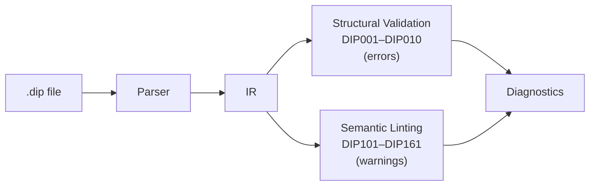

# Validation and Linting Reference

Dippin registers 70 diagnostic codes split into two categories; this page gives a dedicated section to every code except `DIP138`, which is reserved and has no firing logic (69 documented sections):

- **Structural validation** (DIP001–DIP010): Errors that **must** be fixed. A workflow with any of these cannot execute.
- **Semantic linting** (DIP101–DIP161): Warnings that flag likely bugs or questionable patterns. They don't block execution but should be reviewed.

Run `dippin validate <file>` for structural checks only, or `dippin lint <file>` for both.



---

## Diagnostic Format

Diagnostics are displayed in a rustc-inspired format:

```text
error[DIP003]: unknown node reference "InterpretX" in edge
  --> pipeline.dip:45:5
  = help: did you mean "Interpret"?
```

Each diagnostic has:

| Field | Description |
|-------|-------------|
| `Code` | Unique identifier (e.g., DIP003) |
| `Severity` | `error`, `warning`, `info`, or `hint` |
| `Message` | Human-readable explanation of the issue |
| `Location` | File, line, and column where the issue was detected |
| `Help` | Optional suggestion for fixing the issue |
| `Fix` | Optional replacement text |

In JSON output mode (`--format json`), diagnostics are emitted as an array of objects with these exact fields.

---

## Structural Validation Errors (DIP001–DIP010)

### DIP001: Start Node Missing

**Severity**: Error

The workflow must declare a `start:` field pointing to an existing node.

```text
error[DIP001]: start node does not exist
  --> pipeline.dip:1:1
  = help: add "start: <NodeID>" to the workflow header
```

**What triggers it**:
- The `start:` field is missing entirely
- The `start:` field references a node ID that doesn't exist

**How to fix**: Add or correct the `start:` field in the workflow header:
```dippin
workflow MyPipeline
  start: FirstNode    # Must match an actual node ID
  exit: LastNode
```

---

### DIP002: Exit Node Missing

**Severity**: Error

The workflow must declare an `exit:` field pointing to an existing node.

```text
error[DIP002]: exit node does not exist
  --> pipeline.dip:1:1
  = help: add "exit: <NodeID>" to the workflow header
```

**What triggers it**:
- The `exit:` field is missing entirely
- The `exit:` field references a node ID that doesn't exist

**How to fix**: Add or correct the `exit:` field in the workflow header.

---

### DIP003: Unknown Node Reference in Edge

**Severity**: Error

Every edge's `From` and `To` must reference existing node IDs.

```text
error[DIP003]: unknown node reference "InterpretX" in edge
  --> pipeline.dip:45:5
  = help: did you mean "Interpret"?
```

**What triggers it**: An edge references a node that hasn't been declared in the workflow.

**Smart suggestions**: The validator uses Levenshtein distance (edit distance ≤ 2) to suggest corrections for typos.

**How to fix**: Either correct the node name in the edge, or declare the missing node.

---

### DIP004: Unreachable Node from Start

**Severity**: Error

Every node must be reachable from the start node via some path of edges.

```text
error[DIP004]: node unreachable from start
  --> pipeline.dip:20:3
  = help: add an edge leading to this node, or remove it
```

**What triggers it**: BFS from the start node cannot reach this node. The node is an island — connected to nothing or only connected to other unreachable nodes.

**How to fix**: Either add edges that connect this node to the main graph, or remove the orphaned node.

---

### DIP005: Unconditional Cycle Detected

**Severity**: Error

The workflow graph must be a DAG (directed acyclic graph), with the exception of restart edges.

```text
error[DIP005]: unconditional cycle detected
  --> pipeline.dip:50:5
  = help: remove an edge in this cycle or mark it "restart: true"
```

**What triggers it**: DFS finds a back-edge that is not marked `restart: true`. This means the pipeline would loop forever.

**Important**: Restart edges (`restart: true`) are excluded from cycle detection. They are the intentional mechanism for controlled iteration.

**How to fix**: Either remove an edge to break the cycle, or mark the back-edge as `restart: true` to make it a controlled loop.

---

### DIP006: Exit Node Has Outgoing Edges

**Severity**: Error

The exit node is the terminal — it must have zero outgoing edges.

```text
error[DIP006]: exit node has outgoing edges
  --> pipeline.dip:55:5
  = help: remove outgoing edges from the exit node
```

**What triggers it**: An edge has the exit node as its `From` field.

**How to fix**: Remove the outgoing edge. If you need processing after the current exit node, make a new exit node.

---

### DIP007: Parallel/Fan-In Mismatch

**Severity**: Error

Every `parallel` node must have a matching `fan_in` node with the same set of branch nodes.

```text
error[DIP007]: parallel fan-out/fan-in mismatch
  --> pipeline.dip:15:3
  = help: add a matching fan_in node
```

**What triggers it**:
- A `parallel` node exists without a corresponding `fan_in`
- A `fan_in` node exists without a corresponding `parallel`
- The target/source sets don't match between the pair

**How to fix**: Ensure every `parallel P -> A, B, C` has a matching `fan_in J <- A, B, C` with the same nodes (order doesn't matter).

---

### DIP008: Duplicate Node ID

**Severity**: Error

Node IDs must be globally unique within a workflow.

```text
error[DIP008]: duplicate node ID
  --> pipeline.dip:30:3
  = help: rename this node or remove the duplicate
```

**What triggers it**: Two nodes share the same ID.

**How to fix**: Rename one of the duplicate nodes.

---

### DIP009: Duplicate Edge

**Severity**: Error

No two edges may have the same (from, to, condition) combination.

```text
error[DIP009]: duplicate edge
  --> pipeline.dip:60:5
  = help: remove the duplicate edge
```

**What triggers it**: Two edges with identical source, target, and condition raw text.

**Note**: Edges with different conditions on the same (from, to) pair are **not** duplicates — that's intentional conditional branching.

---

### DIP010: Unparseable Edge Condition

**Severity**: Error

Every edge `when` condition must parse into a valid expression. An unparseable
condition leaves the edge's routing undefined, so the workflow cannot execute —
it fails at `dippin simulate` and at runtime. The most common cause is using a
tool-node field (like `marker_grep`) or an unknown operator in operator position.

```text
error[DIP010]: edge A -> Z: invalid condition "marker_grep \"^ok\"": unknown operator "^ok"
  --> pipeline.dip:14:5
  = help: valid operators: = == != contains startswith endswith in (combine with and/or/not)
```

**What triggers it**: An edge condition that fails to parse — an unknown operator,
or a field name used where an operator is expected.

**Note**: One diagnostic fires per unparseable edge (parsing does not stop at the
first failure), and every parseable edge is still checked by the AST-dependent
lints (DIP103/DIP120/DIP121/DIP122), so one bad condition no longer masks the rest.

---

## Semantic Lint Warnings (DIP101–DIP161)

### DIP101: Node Only Reachable via Conditional Edges

**Severity**: Warning

A node where **all** incoming edges have conditions may be unreachable at runtime if no condition matches.

```text
warning[DIP101]: node "NextPhase" is only reachable through conditional edges and may be skipped at runtime
  --> pipeline.dip:25:3
  = help: add an unconditional edge to this node, or verify all conditions are exhaustive
```

**What triggers it**: Every edge leading to this node has a `when` clause. If none of those conditions evaluate to true, execution can never reach this node.

**Exhaustive suppression**: DIP101 is automatically suppressed when **all** source nodes feeding into this node have exhaustive outgoing conditions. For example, if node Gate has edges `Gate -> A when ctx.outcome = success` and `Gate -> B when ctx.outcome = fail`, both A and B are guaranteed reachable because `success` + `fail` covers all outcomes.

Known exhaustive sets: `ctx.outcome` / `outcome` with values `{success, fail}` or `{success, failure}`.

**How to fix**: Add an unconditional incoming edge, or ensure the source node's conditions are exhaustive.

---

### DIP102: Routing Node Missing Default Edge

**Severity**: Warning

A node with conditional outgoing edges but no unconditional fallback.

```text
warning[DIP102]: node "Gate" has conditional outgoing edges but no unconditional default edge
  --> pipeline.dip:35:3
  = help: add an unconditional edge as a fallback, or ensure conditions are exhaustive
```

**What triggers it**: A node has one or more outgoing edges with `when` conditions, but no outgoing edge without a condition.

**Exhaustive suppression**: DIP102 is automatically suppressed when the node's outgoing conditions form an exhaustive set. For example, `when ctx.outcome = success` + `when ctx.outcome = fail` covers all cases — no default edge needed.

**Why it matters**: If no condition matches at runtime and conditions are not exhaustive, execution gets stuck — there's no default path to follow.

**How to fix**: Add an unconditional fallback edge, or ensure conditions are exhaustive:
```dippin
  edges
    Check -> Pass when ctx.outcome = success
    Check -> Retry when ctx.outcome = retry
    Check -> Fail    # unconditional fallback
```

---

### DIP103: Overlapping Conditions

**Severity**: Warning

Multiple edges from the same node test the same variable for the same value.

```text
warning[DIP103]: overlapping or contradictory conditions
  --> pipeline.dip:45:5
```

**What triggers it**: Two edges from node A both check `ctx.outcome = success`. One will shadow the other.

**How to fix**: Remove or merge the duplicate condition.

---

### DIP104: Unbounded Retry Loop

**Severity**: Warning

A retry path has no bound and no failure route — no `max_retries`, no `on fail` edge, and no `fallback_target`/`fallback_retry_target`.

```text
warning[DIP104]: unbounded retry loop (no max_retries or fallback)
  --> pipeline.dip:40:3
```

**What triggers it**: A node has retry configuration but no `max_retries` and no failure route (an `on fail` edge, or a `fallback_target`/`fallback_retry_target`). This could cause infinite retries. Set `max_retries` to bound retries, or add an `on fail` edge for graceful degradation.

**How to fix**: Set `max_retries` and/or `fallback_target`:
```dippin
  agent Validate
    max_retries: 3
    retry_target: Implement
    fallback_target: ManualReview
```

---

### DIP105: No Success Path to Exit

**Severity**: Warning

There is no guaranteed path from start to exit through unconditional edges alone.

```text
warning[DIP105]: no success path from start to exit
  --> pipeline.dip:1:1
```

**What triggers it**: Every path from start to exit goes through at least one conditional edge. If conditions don't match, execution may never reach the exit.

**How to fix**: Ensure at least one complete path from start to exit uses only unconditional edges or has unconditional fallbacks at every decision point.

---

### DIP106: Unrecognized variable reference

**Severity**: Warning

A prompt template has a `${...}` reference that lacks a known namespace prefix or isn't a valid node-scoped ref.

```text
warning[DIP106]: unrecognized variable reference ${user}
  --> pipeline.dip:22:5
```

**What triggers it**: A prompt contains a `${...}` reference that lacks a known namespace prefix (`ctx.`, `graph.`, `params.`, `stack.`) and is not a recognized node-scoped ref (`node.<id>.<key>` or `ctx.node.<id>.<key>` pointing at an existing node). This is a shape/namespace check only — it does **not** verify the key was actually written upstream.

**How to fix**: Namespace the reference (e.g. `${ctx.user}`), or for a node-scoped ref use `${node.<id>.<key>}` with an existing node ID.

---

### DIP107: Unused Context Write

**Severity**: Warning

A node produces a context key that no downstream node reads.

```text
warning[DIP107]: unused context key (written but never read)
  --> pipeline.dip:18:5
```

**What triggers it**: A node declares `writes: summary` but no downstream node has `reads: summary` or references `${ctx.summary}` in its prompt.

**How to fix**: Remove the unused `writes` declaration, or add a downstream consumer.

---

### DIP108: Unknown Model/Provider

**Severity**: Warning

The model or provider isn't in the engine's recognized list.

```text
warning[DIP108]: unknown model/provider combination
  --> pipeline.dip:15:5
```

**What triggers it**: A model or provider string doesn't match any known LLM provider.

**How to fix**: Check for typos. Use recognized model/provider combinations.

**Version-separator spelling**: the model catalog and cost table treat `.` and
`-` in the version portion as equivalent, so a dotted ID and its dashed form are
the same model — `anthropic/claude-haiku-4.5` (the
Vercel AI Gateway spelling) resolves to the dashed catalog key
`claude-haiku-4-5`, and both price identically under `dippin cost`. Carry
whichever spelling your executing runtime requires.

---

### DIP109: Duplicate Subgraph Reference

**Severity**: Warning

Two `subgraph` nodes reference the same `ref:` file, which can collide their context keys.

```text
warning[DIP109]: duplicate subgraph reference
  --> pipeline.dip:28:5
```

**What triggers it**: Two `subgraph` nodes reference the same `ref:` file. The rule keys only on the `ref:` value, so distinct params do **not** silence it.

**How to fix**: Use a different `ref:` for each, or consolidate the duplicate subgraph nodes into one.

---

### DIP110: Empty Prompt on Agent

**Severity**: Warning

An agent node has no prompt text.

```text
warning[DIP110]: empty prompt on agent node
  --> pipeline.dip:12:3
```

**What triggers it**: An agent node is defined without a `prompt` field or with an empty prompt.

**Why it matters**: An agent without a prompt won't produce meaningful output.

**How to fix**: Add a prompt, or change the node kind if it doesn't need one.

---

### DIP111: Tool Without Timeout

**Severity**: Warning

A tool node has no `timeout` field.

```text
warning[DIP111]: tool command has no timeout
  --> pipeline.dip:35:3
```

**What triggers it**: A tool node defines a `command` but no `timeout`.

**Why it matters**: Without a timeout, a hanging command blocks the pipeline indefinitely.

**How to fix**: Add a timeout:
```dippin
  tool RunTests
    timeout: 60s
    command:
      pytest
```

---

### DIP112: Reads Key Not Produced Upstream

**Severity**: Warning

A node declares a `reads` key that no upstream node produces.

```text
warning[DIP112]: reads key not produced by any upstream writes
  --> pipeline.dip:25:3
```

**What triggers it**: A node has `reads: plan` but no node upstream (reachable via incoming edges from start) declares `writes: plan`.

**How to fix**: Either add the key to an upstream node's `writes` or remove it from `reads`.

---

### DIP113: Invalid Retry Policy Name

**Severity**: Warning

A node or workflow default specifies a `retry_policy` value that is not a recognized policy name.

```text
warning[DIP113]: node "analyze" has retry_policy "agressive" which is not a recognized policy name
  --> pipeline.dip:15:3
  = help: valid policies: standard, aggressive, patient, linear, none
```

**Valid policies**:

| Policy | Backoff | Description |
|--------|---------|-------------|
| `standard` | Exponential | Default. 3 attempts, exponential backoff from base delay |
| `aggressive` | Exponential | More attempts, shorter initial delay |
| `patient` | Exponential | Fewer attempts, longer delays between retries |
| `linear` | Linear | Fixed delay between attempts |
| `none` | — | No retries (node fails immediately on error) |

**How to fix**: Check for typos. Use one of the five recognized policy names.

---

### DIP114: Invalid Fidelity Level

**Severity**: Warning

A node or workflow default specifies a `fidelity` value that is not a recognized level.

```text
warning[DIP114]: node "analyze" has fidelity "sumary:high" which is not a recognized level
  --> pipeline.dip:12:3
  = help: valid levels: full, summary:high, summary:medium, summary:low, compact, truncate
```

**Valid fidelity levels**:

| Level | Context Injected | Use Case |
|-------|-----------------|----------|
| `full` | Complete context from all prior nodes | Default for first execution |
| `summary:high` | All keys + trimmed artifacts (2000 chars/node) | Reduce context for large pipelines |
| `summary:medium` | Key decisions only (outcome, last_response, human_response) | Moderate context reduction |
| `summary:low` | One-line summary per completed node | Minimal context |
| `compact` | Only workflow goal + current outcome | Near-zero context |
| `truncate` | Medium keys capped at 500 chars each | Hard size limit |

**Degradation on resume**: When a pipeline resumes from checkpoint, fidelity degrades one level (e.g., `full` → `summary:high`).

**How to fix**: Check for typos. Use one of the six recognized levels.

---

### DIP115: Goal Gate Without Recovery Path

**Severity**: Warning

A node has `goal_gate: true` but no failure route — no `on fail` edge and no `retry_target`/`fallback_target` — meaning the pipeline has no recovery path if the gate fails.

```text
warning[DIP115]: node "validate_tests" has goal_gate: true but no retry_target or fallback_target
  --> pipeline.dip:18:3
  = help: add an `on fail` edge, set fallback_target:, or add retry_target with max_retries so the pipeline can recover when the gate fails
```

**What `goal_gate` means**: When a node with `goal_gate: true` completes with `outcome != success`, the pipeline fails at exit — even if the exit node itself succeeded. Goal gates enforce invariants (e.g., "all tests must pass").

**How to fix**: Add `retry_target: <node>` to retry from an earlier point, or `fallback_target: <node>` to route to a recovery path.

---

### DIP116: Invalid Compaction Threshold or On-Resume Value

**Severity**: Warning

Configuration values for `compaction_threshold` or `on_resume` are outside valid ranges.

```text
warning[DIP116]: node "Analyze" has compaction_threshold 1.50 outside valid range [0.0, 1.0]
  --> pipeline.dip:15:3
```

**What triggers it**:
- `compaction_threshold` is set to a value outside `[0.0, 1.0]`
- `on_resume` is set to a value other than `"preserve"` or `"degrade"`
- `on_resume` is set without `fidelity` being configured

**How to fix**: Use a threshold between 0.0 and 1.0, and set on_resume to `"preserve"` or `"degrade"`.

---

### DIP117: Stylesheet References Undefined Class

**Severity**: Warning

A stylesheet rule targets a class that no node declares.

```text
warning[DIP117]: stylesheet references class "critical" which is not declared on any node
  --> pipeline.dip:80:5
  = help: add class: critical to a node declaration
```

**How to fix**: Add `class: critical` to the relevant node, or fix the class name in the stylesheet.

---

### DIP118: Stylesheet References Unknown Node ID

**Severity**: Warning

A stylesheet rule targets a node ID that doesn't exist.

```text
warning[DIP118]: stylesheet references node ID "Analize" which does not exist
  --> pipeline.dip:82:5
```

**How to fix**: Fix the node ID spelling in the stylesheet selector.

---

### DIP119: Invalid Reasoning Effort

**Severity**: Warning

A node specifies a `reasoning_effort` value that isn't recognized.

```text
warning[DIP119]: node "Analyze" has reasoning_effort "extreme" which is not a recognized level
  --> pipeline.dip:12:3
  = help: valid levels: none, minimal, low, medium, high, xhigh, max
```

**Valid levels**: `none`, `minimal`, `low`, `medium`, `high`, `xhigh`, `max`

**How to fix**: Use one of the seven recognized levels.

---

### DIP120: Condition Variable Missing Namespace Prefix

**Severity**: Warning

A condition references a variable without a namespace prefix.

```text
warning[DIP120]: condition variable "outcome" should use a namespace prefix (e.g., ctx.outcome)
  --> pipeline.dip:45:5
```

**What triggers it**: An edge condition uses a bare variable name like `outcome` instead of `ctx.outcome`.

**How to fix**: Add the appropriate namespace prefix (`ctx.`, `graph.`, `params.`).

---

### DIP121: Condition References Variable Not in Source Writes

**Severity**: Warning

An edge condition references a variable that the source node doesn't declare in its `writes`.

```text
warning[DIP121]: edge Gate → Pass: condition references "ctx.score" but node "Gate" does not declare it in writes
  --> pipeline.dip:45:5
  = help: add writes: score to node "Gate", or use a reserved variable
```

**What triggers it**: An edge from node A has a condition like `ctx.score = high`, but node A's `IO.Writes` doesn't include `score`. Only fires when the source node has non-empty `writes` declarations.

**Skipped for**: Reserved runtime variables (`ctx.outcome`, `ctx.status`, `ctx.tool_stdout`, `ctx.tool_stderr`, `ctx.tool_marker`, `ctx.tool_route`, `ctx.internal.*`, `graph.*`, `params.*`).

**How to fix**: Add the variable to the source node's `writes` list, or verify the condition references the correct variable.

---

### DIP122: Condition Tests Value Not in Tool Outputs

**Severity**: Warning

An edge condition tests a value that the source tool node doesn't declare in its `outputs`.

```text
warning[DIP122]: edge RunTest → Pass: condition tests value "retry" but tool "RunTest" does not declare it in outputs
  --> pipeline.dip:50:5
  = help: add "retry" to tool "RunTest" outputs, or check for typos
```

**What triggers it**: A tool node declares `outputs: ["success", "fail"]` but an outgoing edge condition checks `ctx.outcome = retry`. Only fires for tool nodes with explicitly declared outputs.

**How to fix**: Add the missing value to the tool's `outputs` list, or fix the typo in the condition.

---

### DIP123: Tool Command Shell Syntax Error

**Severity**: Warning

The tool command block has a shell syntax error detectable by `bash -n`.

```text
warning[DIP123]: tool command has shell syntax error: unexpected EOF while looking for matching `"'
  --> pipeline.dip:45:5
```

**What triggers it**: Running `bash -n` on the command block reports an error — unclosed quotes, bad redirects, missing `fi`/`done`, etc.

**How to fix**: Fix the syntax error. Test your command in a terminal: `echo 'your command' | bash -n`

---

### DIP124: Tool Command References Runtime Variable

**Severity**: Warning

A tool command contains `${ctx.*}` interpolation that won't resolve at shell execution time.

```text
warning[DIP124]: tool command references ${ctx.api_url} which expands to empty at runtime
  --> pipeline.dip:50:5
```

**What triggers it**: The command block contains patterns like `${ctx.outcome}`, `${ctx.tool_stdout}`, etc. These are Dippin runtime variables — the shell sees them as undefined variables that expand to empty strings.

**How to fix**: Pass context values through environment variables set by the pipeline runner, or use file-based IPC (write to a shared `.ai/` directory).

---

### DIP125: Tool Command Binary Not Found

**Severity**: Hint

The first non-preamble command in the tool block references a binary not found on the current PATH.

```text
hint[DIP125]: tool command binary "npx" not found on PATH
  --> pipeline.dip:55:5
```

**What triggers it**: The linter extracts the first real command (skipping `set -eu`, `cd`, `export`, `mkdir -p` preamble lines) and checks if the binary exists via `exec.LookPath`.

**How to fix**: Install the missing binary, or use a full path. Note: this check runs on the developer's machine — the deployment environment may have different binaries available.

**Caveat**: This is a hint (not a warning) because PATH is environment-dependent. A binary missing on your laptop may exist in the pipeline runner's container.

---

### DIP126: Subgraph Ref File Not Found

**Severity**: Warning

A subgraph node references a file that does not exist at the declared path.

```text
warning[DIP126]: subgraph node "Review" references "review_pipeline.dip" which does not exist
  --> pipeline.dip:28:5
  = help: resolved path: /home/user/project/review_pipeline.dip
```

**What triggers it**: A `subgraph` node declares `ref: path/to/workflow.dip` but the file cannot be found on disk. The path is resolved relative to the workflow source file's directory.

**How to fix**: Verify the file path is correct, or create the missing workflow file. Absolute paths are also supported.

**Note**: This check is skipped when source file context is unavailable (e.g., hand-constructed IR in tests) and in WASM environments where filesystem access is not available.

### DIP127: Invalid Human Node Mode

**Severity**: Warning

A human node has a `mode` value that is not one of the recognized modes.

```text
warning[DIP127]: node "Gate" has mode "interactive" which is not a recognized human mode
  --> pipeline.dip:12:3
  = help: valid modes: choice, freeform, interview, yes_no
```

**What triggers it**: A human node declares a mode other than `choice`, `freeform`, `interview`, or `yes_no`.

**How to fix**: Change the mode to a valid value.

### DIP128: Interview Mode with Meaningless Default

**Severity**: Warning

A human node with `mode: interview` also sets a `default` value. Interview mode collects structured answers — it has no predefined choices to default to.

```text
warning[DIP128]: node "Ask" is mode interview but has default "yes" which is ignored
  --> pipeline.dip:15:3
  = help: default is only meaningful for choice mode; remove it
```

**What triggers it**: `mode: interview` combined with a non-empty `default` field.

**How to fix**: Remove the `default` field, or change the mode to `choice` if you want label-based routing.

### DIP129: Interview Mode with Conflicting Choice-Style Edges

**Severity**: Warning

A human node with `mode: interview` has multiple labeled outgoing edges. Interview mode does not route by label — it collects answers and follows a single unconditional edge.

```text
warning[DIP129]: node "Ask" is mode interview but has 2 labeled edges (interview does not route by label)
  --> pipeline.dip:15:3
  = help: interview mode collects answers, not choices; use mode choice for label-based routing
```

**What triggers it**: A `mode: interview` node has 2 or more outgoing edges with labels.

**How to fix**: Remove edge labels, or change the mode to `choice` if routing by selection is intended.

### DIP130: Invalid `response_format` Value

**Severity**: Warning

An agent node (or any node) specifies a `response_format` value that is not one of the recognized values.

```text
warning[DIP130]: node "Analyze" has response_format "json" which is not a recognized value
  --> pipeline.dip:12:3
  = help: valid values: json_object, json_schema
```

**What triggers it**: A `response_format` field is set to anything other than `json_object` or `json_schema`. Also fires when `response_format` is used on non-agent nodes, where it has no effect.

**How to fix**: Use one of the two recognized values:
- `json_object` — Forces the LLM to return valid JSON (any shape).
- `json_schema` — Forces the LLM to return JSON matching the schema in `response_schema`.

---

### DIP131: `response_schema` / `response_format` Mismatch

**Severity**: Warning (or Hint)

There is a mismatch between `response_schema` and `response_format: json_schema`.

```text
warning[DIP131]: node "Analyze" has response_schema but response_format is not json_schema
  --> pipeline.dip:12:3
  = help: set response_format: json_schema to enforce the schema

hint[DIP131]: node "Analyze" has response_format: json_schema but no response_schema
  --> pipeline.dip:12:3
  = help: add a response_schema block to define the expected JSON shape
```

**What triggers it**:
- `response_schema` is set but `response_format` is not `json_schema` — the schema will be ignored (warning).
- `response_format: json_schema` is set but `response_schema` is absent — schema enforcement has no definition (hint).

**How to fix**: Ensure both fields are set together when using schema-constrained output.

---

### DIP132: `response_schema` Must Be Valid JSON

**Severity**: Warning

The content of the `response_schema` block is not valid JSON.

```text
warning[DIP132]: node "Analyze" has response_schema that is not valid JSON
  --> pipeline.dip:12:3
  = help: response_schema must be a valid JSON Schema object
```

**What triggers it**: The `response_schema` multiline block cannot be parsed as valid JSON.

**How to fix**: Ensure the schema block contains valid JSON. The content must be a JSON object (typically a JSON Schema definition).

---

### DIP133: Agent `params` Key Shadows First-Class Field

**Severity**: Hint

An agent node's `params` block contains a key that matches a first-class agent field (e.g., `model`, `provider`).

```text
hint[DIP133]: node "Analyze" params key "model" shadows the first-class field model
  --> pipeline.dip:12:3
  = help: use the top-level model: field instead of params: model to avoid ambiguity
```

**What triggers it**: A key in the agent's `params` block has the same name as a recognized first-class field like `model`, `provider`, `prompt`, `system_prompt`, etc.

**How to fix**: Move the value to the appropriate first-class field, or rename the params key if the intent is to pass it through as a custom parameter.

---

### DIP134: max_retries Set With Restart Edges but No max_restarts

**Severity**: Warning

`max_retries` is set in defaults and the workflow has `restart: true` edges, but `max_restarts` is not set. These are commonly confused: `max_retries` controls per-node LLM retries, while `max_restarts` controls the global loop restart budget.

**What triggers it**: `defaults.max_retries` is set and at least one edge is marked `restart: true`, but `defaults.max_restarts` is absent.

**How to fix**: Set `max_restarts` in defaults to control loop iterations, or add it alongside `max_retries` if both behaviors are intended:
```dippin
  defaults
    max_retries: 3       # per-node LLM retry attempts
    max_restarts: 5      # global loop restart budget
```

---

### DIP135: manager_loop subgraph_ref Missing or File Does Not Exist

**Severity**: Warning

A `manager_loop` node either has no `subgraph_ref` field set, or the referenced file cannot be found on disk.

```text
warning[DIP135]: manager_loop node "Supervise" has no subgraph_ref or the file does not exist
  --> pipeline.dip:12:3
  = help: set subgraph_ref to the path of an existing .dip file that defines the child pipeline
```

**What triggers it**: A `manager_loop` node is declared without `subgraph_ref`, or the path in `subgraph_ref` does not resolve to an existing file (resolved relative to the workflow source file's directory).

**How to fix**: Set `subgraph_ref` to the path of an existing `.dip` file that defines the child pipeline:
```dippin
  manager_loop Supervise
    subgraph_ref: quality_loop.dip  # file must exist relative to this workflow
```

---

### DIP136: manager_loop Control Field Has Invalid Value

**Severity**: Warning

A `manager_loop` node has a `poll_interval` or `max_cycles` value that is negative.

```text
warning[DIP136]: manager_loop node "Supervise" poll_interval is negative
  --> pipeline.dip:12:3
  = help: use non-negative values for poll_interval and max_cycles
```

**What triggers it**: `poll_interval` or `max_cycles` is set to a negative value.

**How to fix**: Use non-negative values for both fields:
```dippin
  manager_loop Supervise
    subgraph_ref: inner.dip
    poll_interval: 30s    # non-negative duration
    max_cycles: 10        # non-negative integer
```

---

### DIP137: Unbounded manager_loop

**Severity**: Warning

A `manager_loop` node has neither a `stop_condition` nor a `max_cycles` cap, so supervision can run forever.

```text
warning[DIP137]: manager_loop node "Supervise" is unbounded: no stop_condition and no max_cycles
  --> pipeline.dip:12:3
  = help: set stop_condition (e.g., stack.child.outcome = success) or max_cycles to bound supervision
```

**What triggers it**: A `manager_loop` node declares neither `stop_condition` nor `max_cycles`.

**How to fix**: Set `stop_condition` or `max_cycles` (or both) to bound the supervision loop:
```dippin
  manager_loop Supervise
    subgraph_ref: inner.dip
    stop_condition: stack.child.outcome = success  # or: max_cycles: 20
```

---

### DIP139: Invalid tool_access Value on Agent Node or Parallel Branch

**Severity**: Warning

An agent node has `tool_access:` set to a value other than `none` (case-insensitive) or empty. The field is the v0.32.0 safety primitive that strips an LLM's tool catalog; v1 recognizes only one explicit value.

```text
warning[DIP139]: node "ReportFinalStatus" has tool_access "nono" which is not recognized
  --> pipeline.dip:12:3
  = help: use `tool_access: none` to disable LLM tools, or omit the field for the full catalog
```

**What triggers it**: An agent node declares `tool_access:` with a value other than `none` (case-insensitive) or empty. Invalid values fall back to no-tools at runtime (fail-closed) — the diagnostic surfaces the typo so author intent matches runtime behavior. Also fires on a per-branch override within a parallel node that sets `tool_access` to an unrecognized value.

**How to fix**: Use `tool_access: none` to disable LLM tools, or omit the field for the full catalog:
```dippin
  agent ReportFinalStatus
    prompt: "Summarize the results"
    tool_access: none    # explicit: no LLM tools
```

---

### DIP140: `params` Re-enables Tools That `tool_access` Strips

**Severity**: Warning

An agent node sets `tool_access` (any non-empty value) and also sets a `params` key that would re-grant tools: `allowed_tools`, `disallowed_tools`, `tool_choice`, or `permission_mode`. When `tool_access` is set, the runtime ignores these `params` keys (fail-closed), so the override is silently neutralized — a likely bypass attempt or dead config.

```text
warning[DIP140]: node "Summarize" sets tool_access but params key "allowed_tools" re-enables tools — tool_access wins (fail-closed)
  --> pipeline.dip:12:3
  = help: remove the params key; tool_access governs the tool catalog. To grant tools instead, omit tool_access.
```

**What triggers it**: An agent node has `tool_access` set (any non-empty value) and its `params` block contains any of: `allowed_tools`, `disallowed_tools`, `tool_choice`, or `permission_mode`.

**How to fix**: Remove the conflicting `params` key. If you want tools available, omit `tool_access` instead:
```dippin
  agent Summarize
    prompt: "Summarize"
    tool_access: none
    params:
      allowed_tools: Bash   # DIP140: the runtime strips this — tool_access wins
  # Fix: remove the params key, or remove tool_access to grant the tool
```

---

### DIP141: `writable_paths` Nullified by `tool_access: none`

**Severity**: Warning

An agent node or per-branch override sets `writable_paths` together with `tool_access: none` on the same object. `tool_access: none` strips the entire tool catalog, so there is no Write/Edit/Bash left for `writable_paths` to bound — the field is dead config.

```text
warning[DIP141]: node "Summarize" has writable_paths but tool_access "none" — none strips all tools, so there is nothing to bound (dead config)
  --> pipeline.dip:12:3
  = help: remove writable_paths (no tools to bound) or drop tool_access: none to grant a bounded tool catalog.
```

**What triggers it**: An agent node or a per-branch override declares both a non-empty `writable_paths` and `tool_access: none` (case-insensitive) on the same object. Only the *same config object* declaring both is flagged — a branch that sets `tool_access: none` while *inheriting* an agent's `writable_paths` is legitimate narrowing and is not flagged.

**How to fix**: Remove `writable_paths` (there are no tools to bound) or drop `tool_access: none` to grant a bounded tool catalog:

```dippin
  agent Summarize
    prompt: "Summarize the results"
    tool_access: none
    writable_paths: workspace/**   # DIP141: none strips all tools — nothing to bound
```

---

### DIP142: Unsafe `writable_paths` Entry

**Severity**: Warning

A `writable_paths` entry is an absolute path, starts with `~` or a Windows drive, escapes its base via `..`, or is a brace-expansion fragment torn apart by comma-splitting. Such an entry will not bound writes to the workspace the way the author expects.

```text
warning[DIP142]: node "Recorder" writable_paths entry "/etc/**" escapes the workspace (absolute / ~ / parent path) — the runtime write-jail will not honor it
  --> pipeline.dip:12:3
  = help: use workspace-relative globs (e.g. .ai/sprints/**). Absolute, ~, and ..-escaping entries are rejected by the fs jail (it bounds writes to the session root); this lint catches obvious lexical cases only — the runtime jail is the real boundary. See #67/#77.
```

**What triggers it**: A `writable_paths` entry matches any of:
- **Absolute** — leading `/`, `~`, `\`, or Windows drive letter (`C:\`)
- **Parent escape** — contains a `..` segment that escapes the base (e.g. `../../etc/**`, `foo/../../bar`)
- **Brace mis-split** — unbalanced `{` or `}` (a glob like `*.{md,yaml}` is torn apart by comma-splitting into `*.{md` and `yaml}` — enumerate entries instead)

This is a lexical clarity check, not the security boundary — the runtime fs-jail is authoritative.

**How to fix**: Use workspace-relative globs. Enumerate brace-expansion alternatives:

```dippin
  agent Recorder
    prompt: "record"
    writable_paths: /etc/**   # DIP142: absolute path escapes the workspace jail
    # Fix: writable_paths: workspace/output.md
```

---

### DIP143: Referenced Subgraph Does Not Inherit `tool_access`

**Severity**: Hint

A `manager_loop` (`subgraph_ref`) or `subgraph` (`ref`) node references a child `.dip` file, and this workflow declares `tool_access` on at least one agent or parallel branch. `tool_access` is a per-node primitive and does not cross a file boundary — the child subgraph's agents are governed entirely by their own file, so the parent's restriction does not propagate into it.

```text
hint[DIP143]: manager_loop "Supervise" references subgraph "child.dip", defined in its own file; this workflow's tool_access restrictions do not extend across the subgraph boundary
  --> pipeline.dip:9:3
  = help: audit the agents in "child.dip" for their own tool_access — restrictions declared in this workflow do not propagate into a referenced subgraph. Cross-file enforcement is tracked as #89.
```

**What triggers it**: All of the following hold:
- A node references an external subgraph — `manager_loop` via `subgraph_ref`, or `subgraph` via `ref` (non-empty).
- The workflow declares `tool_access` (any non-empty value — a fail-closed typo still expresses restriction) on some agent or parallel branch.

A node whose ref resolves to its **own source file** (a direct self-reference) is not flagged — there is no cross-file boundary. Transitive cross-file cycles (A → B → A) are not detected and are deferred to [#89](https://github.com/2389-research/dippin-lang/issues/89).

This is a Hint, not a Warning: the referencing node has no defect. The check is **file-level** — it does not verify that the restricted node and the subgraph node are related, and it does **not** read the child file (the validator cannot parse it). It bounds the child's *tool catalog* concern, not information flow across the supervisory boundary (`steer_context` / `stack.child.*` — see [#56](https://github.com/2389-research/dippin-lang/issues/56)). Real cross-file effective-access enforcement is deferred to [#89](https://github.com/2389-research/dippin-lang/issues/89).

**How to fix**: Open the referenced `.dip` and give its agents their own `tool_access`:

```dippin
  agent Summarize
    tool_access: none
  manager_loop Supervise
    subgraph_ref: child.dip   # DIP143: child.dip's agents must set their own tool_access
```

---

### DIP144: Agent Node Has No Failure Route

**Severity**: Warning

An agent node has no declared failure route at any level. If the node fails at runtime, the pipeline has nowhere to go and will halt.

```text
warning[DIP144]: agent node "Build" has no failure route (no fail edge, no fallback_target, no bounded retry, no graph on_failure)
  --> pipeline.dip:12:3
  = help: add `-> <node> when ctx.outcome = fail`, set fallback_target:, add retry_target with max_retries, or declare a workflow-level on_failure:
```

This warning is especially important for agents with a bounded `max_turns`: turn
exhaustion ends the node as `fail`, so without a failure route the run halts on
exhaustion.

**What triggers it**: An `agent` node that has none of:
- An outgoing edge with `when ctx.outcome = fail` (or `failure`)
- A `fallback_target` field
- A `retry_target` + `max_retries` bounded retry
- A `defaults.on_failure` declared on the workflow

**Does not fire on**: `human`, `tool`, `parallel`, `fan_in`, `conditional`, `subgraph`, or `manager_loop` nodes.

**How to fix**: Add any one of the four suppression routes:

```dippin
  # Option 1: explicit fail edge
  edges
    Build -> Escalate when ctx.outcome = fail

  # Option 2: node fallback_target
  agent Build
    fallback_target: Escalate

  # Option 3: bounded retry
  agent Build
    retry_target: Build
    max_retries: 3
    fallback_target: Escalate

  # Option 4: graph-level catch-all
  defaults
    on_failure: Escalate
```

See [edges.md](edges.md) — Failure Handling for the full five-level precedence cascade.

---

### DIP145: Negative Graph Budget Default

A workflow budget default is set to a negative value. Budgets are non-negative;
`0` (or unset) means **no limit**.

```text
warning[DIP145]: workflow budget default max_cost_cents is -5; budgets cannot be negative
```

**Trigger:** `max_total_tokens`, `max_cost_cents`, `max_wall_time`, or
`stall_timeout` in the `defaults` block is negative.

**Fix:** Use a positive cap, or omit the field / set `0` for no limit. Note `0`
means *unlimited*, not "zero budget."

---

### DIP146: Child Subgraph Re-Grants Restricted Tools (cross-file)

`dippin lint` resolves a `manager_loop` (`subgraph_ref`) or `subgraph` (`ref`)
child across the file boundary and finds it declares **no** `tool_access`
restriction on any agent, while a workflow on the path from the linted entry
restricts tools. Unlike DIP143 (which cannot read the child), DIP146 reads and
confirms the child, and traverses transitively. The traversal is intent-aware: a
child reached through both a no-intent path and a restricting path is still checked
under the restricting path ([#109](https://github.com/2389-research/dippin-lang/issues/109)).

```text
hint[DIP146]: manager_loop "Supervise" delegates to subgraph "worker.dip", which declares no tool_access restriction on any agent; a workflow on this path restricts tools, but the restriction does not cross the subgraph boundary
```

**Trigger:** A workflow on the path declares `tool_access` on some agent/branch,
and a resolved child restricts none of its agents. A child that restricts every
agent is silent; one that restricts some but leaves a tool-bearing agent open
keeps the DIP143 advisory instead. Emitted by the CLI only (native), not by the
wasm/playground linter.

**Fix:** Give the child's agents their own `tool_access` (e.g. `tool_access:
none`). Restrictions in a parent do not flow into a referenced subgraph.

**What DIP146 does NOT check:** DIP146 *does* traverse transitively (whenever a
workflow on the path declares `tool_access` — same gate as DIP146) — a zero-intent
grandchild is flagged, and a **partial-audit or unparseable** child is now also
flagged with a DIP143 advisory at *any* depth: the entry's own boundaries (depth 0)
from `validator.Lint` as before, and **deeper boundaries (depth ≥ 1)** from the
cross-file pass
([#102](https://github.com/2389-research/dippin-lang/issues/102)). If no workflow on
the path restricts tools, nothing is flagged — there is no restriction to escape.
Out of scope:
information flow across the supervisory boundary (`steer_context` /
`stack.child.*` — see [#56](https://github.com/2389-research/dippin-lang/issues/56));
runtime enforcement (the tracker runtime enforces; dippin detects). A clean
result means every resolvable child is fully locked down or had no restriction to
escape — not that the child's tools are restricted at runtime.

---

### DIP147: Restricted Agent Output Flows Into a Tool-Bearing Agent (chain-attack)

A `tool_access: none` agent declares a context key in `writes:`, and a
tool-bearing agent (`tool_access` omitted / full catalog) reachable downstream
declares that same key in `reads:`. `tool_access` bounds the restricted agent's
**tools**, not its **information flow** — so a prompt-injection payload it
processed can launder through the named key into a privileged agent's prompt and
drive that agent's tools. This detects one vector of the gap the `tool_access`
arc leaves open ([#56](https://github.com/2389-research/dippin-lang/issues/56)) —
the explicit declared-key flow; the `${ctx.last_response}` auto-injection vector
and a truncation mitigation remain follow-ups.

```text
hint[DIP147]: restricted agent "Summarize" (tool_access: none) writes context key "tainted" that tool-bearing agent "Writer" reads — its output reaches a privileged prompt
```

**Trigger:** A restricted agent (`tool_access: none`) writes a context key that a
downstream tool-bearing agent reads. The flow is followed multi-hop via
forward-edge reachability, so a non-agent node (e.g. a tool node) between them
does not hide it. The source is canonical `none` only (invalid values are
DIP139's domain and fail closed); the sink is the full catalog (`tool_access`
omitted); both must be agent nodes. `none → none` (no escalation) and
`full → …` (no restricted source) do not fire.

**Fix:** Confirm the restricted agent's input is trusted. If it is not, give the
consuming agent `tool_access: none` too, or insert a sanitizing / validating step
between them so untrusted text never reaches a privileged prompt verbatim.

**Scope:** DIP147 is a **Hint** (a restricted-source key flow over trusted input
is legitimate, and there is no per-diagnostic suppression) and fires only on an
**explicit, author-declared** `writes:`/`reads:` key dependency. The bare
`${ctx.last_response}` auto-injection edge (a `none → full` edge with no declared
key) is **not** flagged — that topology is
[#57](https://github.com/2389-research/dippin-lang/issues/57) (deferred), and its
mitigation (`last_response_truncate:`) is a #56 follow-up. Cross-file chains and
parallel-branch / `fan_in` / `manager_loop` vectors are also follow-ups.
Detection only: dippin flags the topology; the tracker runtime enforces the
information-flow bound.

---

### DIP148: Negative `last_response_truncate`

**Severity**: Warning

An agent node or a parallel-branch override sets `last_response_truncate` to a
negative value. The field is a character cap on the prior node's response before
it is auto-injected into this agent's prompt (a #56 mitigation for the
`${ctx.last_response}` flow); a negative cap is meaningless. On an agent, `0` (or
unset) means **no truncation**; on a parallel-branch override, `0` (or unset)
**inherits the target agent's cap** (it does not disable truncation).

```text
warning[DIP148]: agent "Writer" last_response_truncate is -1; cannot be negative
```

**Trigger:** `last_response_truncate` is negative on an `agent` node or on a
per-branch override within a `parallel` node.

**Fix:** Use a non-negative character count to cap the injected response. On an
agent, omit the field (equivalently `0`) for no truncation — `0` means *no
truncation*, not "truncate to zero." On a parallel-branch override, `0` (or unset)
**inherits the target agent's cap** (a branch cannot reset to no truncation when
the agent sets a positive cap). Detection only: dippin carries and lints the
field; a runtime enforces the truncation.

---

### DIP149: Ambiguous routing

**Severity**: Warning

A node has two or more **unconditional** (no `when`) outgoing edges. Both are
equally eligible, so which one fires is decided only by the routing cascade's
[lexical tiebreak](edges.md#routing-priority) — alphabetical order of the target
node ID. That is silent action-at-a-distance: renaming a target node can change
which edge fires with no other change.

```text
warning[DIP149]: node "Route" has multiple unconditional outgoing edges; which one fires is decided only by the lexical tiebreak
```

**Trigger:** A node has 2+ outgoing edges with no condition. Restart back-edges
(`restart: true` or the `loop` keyword) are excluded — they are a distinct
re-execution channel, not a forward-routing competitor.

**Fix:** Keep at most one unconditional edge per node as the default fallback;
guard the others with a `when` condition, or remove the extra edge. A guarded
edge plus a single unconditional fallback is the intended pattern and is **not**
flagged. Conservative by design — duplicate same-variable/same-value guards are
covered by [DIP103](#dip103-overlapping-conditions) instead.

---

### DIP150: Human gate routes by label

**Severity**: Hint

An outgoing edge from a `human` node sets a non-empty `label:` but no `choice:`.
In Phase 0 such a label is overloaded: besides being the DOT display text, it is
also the **routing key** the runtime matches the user's selection against — on a
human gate the labels are load-bearing and even order-sensitive. Nothing in the
syntax tells a reader whether deleting that `label:` is cosmetic or breaks
routing. `choice:` makes the routing-key intent explicit while leaving `label:`
for display.

```text
hint[DIP150]: human gate "Approve" routes by label "yes"; use choice: "yes" to mark the routing key (label: stays for display)
```

**Trigger:** A **label-routing** `human` node — mode `choice`, `yes_no`, or the
unset default (a mode-less human gate with labeled edges is the canonical
multi-choice gate) — has an outgoing edge with a non-empty `label:` and no
`choice:`. It does **not** fire when `choice:` is already present, for an edge
whose source node is not a `human` node, or for `freeform` and `interview` gates
(they route by open text / collected answers, not edge labels).

**Fix:** Add `choice: "<key>"` to mark the routing key explicitly, leaving
`label:` for display. This is a Hint, not a Warning — these workflows route
correctly today, so `choice:` is a clarity upgrade rather than a defect.

**Phase-0 fallback rule (runtime contract):** `choice:` wins as the routing key
when present; when it is absent, `label:` still serves as the routing key, so
existing human-choice workflows route unchanged. See
[choice keys vs display labels](edges.md#choice-keys-vs-display-labels).

---

### DIP151: Edge weight is unused by routing

**Severity**: Warning

An edge carries a `weight:` attribute. `weight:` was tier 4 of the 5-level
routing cascade — a speculative priority hint meant to break ties when conditions
and labels don't resolve a choice. In practice the cascade never consults it and
no real workflow uses it. The keyword still **parses** (carry-only, no breakage
in Phase 0), but both the keyword and the cascade tier are slated for removal
under `dip 2`. This warning is the soft-deprecation signal.

```text
warning[DIP151]: edge "Route" -> "A" sets weight: 5, which routing does not use; guard edges with when / on or rely on a single unconditional fallback instead
```

**Trigger:** Any edge with a non-zero `weight:` value (`weight:` defaults to 0
when unset). One diagnostic per offending edge.

**Fix:** Remove `weight:`. Express edge priority with conditions instead — guard
edges with `when` / `on`, or rely on a single unconditional fallback to make
routing explicit and deterministic.

---

### DIP152: marker_grep enumerates an unrouted marker

**Severity**: Warning

A tool node's `marker_grep` enumerates a literal marker that no outgoing edge
routes and that no section `else ->` default or unconditional fallback edge
covers. That marker would be emitted at runtime with nowhere to go. Only checked
when `marker_grep` is a recognizable literal alternation (e.g. `^(a|b|c)$` or a
bare literal); complex regexes are left unflagged.

```text
warning[DIP152]: tool node "RunTests" emits markers that no edge routes and no else default covers: tests-failed
```

**Trigger:** The routing is simple enough to be certain of a gap — every outgoing
edge is a plain `on <marker>` / `when ctx.tool_marker = <marker>` equality, some
enumerated marker is unrouted, and there is no `else` default or unconditional
edge. Any compound (`or`), negated (`!=` / `not`), or other-variable edge makes
the node safe (no warning), and non-enumerable regexes are skipped entirely.

**Fix:** Route the marker with an edge (`RunTests -> <node> on tests-failed`),
add an unconditional fallback edge, or add a section `else -> <node>` default.

---

### DIP153: redundant parallel/fan_in edge

**Severity**: Warning

An `edges` block declares an unconditional, attribute-free edge that merely
repeats a fork already declared inline on a `parallel` or `fan_in` node. The
inline list is the single source of truth — validation, simulation, and DOT
export all derive the fan edges from it — so the re-declaration conveys nothing
new and must be kept in sync by hand.

```text
warning[DIP153]: edges-block edge 'Fan -> A' redundantly repeats the inline parallel/fan_in fork; the inline list is authoritative — run 'dippin fmt' to remove it (rejected under 'dip 2')
```

**Trigger:** An edge whose `From` is a `parallel` node listing `To` as a target,
or whose `To` is a `fan_in` node listing `From` as a source, and which carries no
guard (`when`/`on`) and no attribute (`label:`, `choice:`, `weight:`, `override`,
restart). A conditional or attributed edge between the same nodes is **not**
redundant and is left untouched.

**Fix:** Remove the redundant edge — `dippin fmt` strips it automatically. Under
a `dip 2` header the re-declaration is rejected outright (a parse error) rather
than warned.

---

### DIP154: prompt-cascade opt-out is a no-op

**Severity**: Hint

An agent sets `prompt_prefix: none` or `prompt_suffix: none` to opt out of the
defaults prompt cascade, but the `defaults` block declares no cascade of that
kind — so the opt-out does nothing (likely a leftover or a mistake).

```text
hint[DIP154]: agent "A" sets prompt_suffix: none but no defaults prompt_suffix cascade is declared — the opt-out is a no-op
```

**Fix:** Remove the unnecessary `prompt_prefix: none` / `prompt_suffix: none`, or
add the intended cascade (`prompt_suffix_file:` / `prompt_suffix:`) to `defaults`.

---

### DIP155: Unrecognized Input Type

**Severity**: Error

An entry in the `inputs` block declares a type outside the v1 closed set
(`text`, `number`, `bool`, `enum`, `file`, `secret`). The parser accepts any
type token so a `.dip` using a future type stays parseable, formattable and
packable on an older `dippin` — only the lint complains.

```text
error[DIP155]: input "when" declares unrecognized type "duration"
```

**Fix:** Use one of the known types, or upgrade `dippin` if this type is newer
than this build.

---

### DIP156: Reference to an Undeclared Input

**Severity**: Error

A prompt or edge condition references `${inputs.x}` (or bare `inputs.x` in a
condition) for a name the workflow's `inputs` block does not declare. `inputs`
is the only closed namespace in the language — `ctx` is open, so a typo there
is undetectable, which is precisely why caller input does not live in `ctx`
(see [context.md](context.md)).

```text
error[DIP156]: node "Plan" references undeclared input ${inputs.idae}
```

**Fix:** Declare the input in the workflow's `inputs` block, or correct the
name.

---

### DIP157: Input Reference in a Tool Command

**Severity**: Error

A tool node's `command:` body references `${inputs.x}`. The lint scans the
node's resolved `Command` text, so a `command_file:` directive is checked the
same way once it has been read into `Command` — the lint never reads an
unresolved external file off disk itself. The runtime keeps the entire
`inputs` namespace off its shell-interpolation allowlist (the same mechanism
that blocks LLM-origin `ctx.*` keys from reaching a shell), so the reference
is dead text that silently expands to nothing, regardless of input type.

```text
error[DIP157]: tool "RunScript" references ${inputs.idea}, which never interpolates in a command
```

**Fix:** Move the reference to an `agent`/`human` node's prompt. If the value
is a `secret`, pass it through the runtime's credential mechanism instead of
interpolating it — the runtime never expands `inputs` into a shell command.

---

### DIP158: Invalid or Inapplicable Input Constraint

**Severity**: Error

An input's constraint is malformed or does not apply to its declared type. Each
constraint attribute is scoped to certain types: `pattern`, `max_length`, and
`multiline` apply to `text` (and `secret`); `min`/`max` to `number`; `options`
to `enum`. DIP158 fires when:

- an `enum` `default` is not one of its `options`,
- a `number`'s `min` exceeds its `max`,
- a `pattern` is not a valid regular expression, or
- any constraint is set on a type that has no such constraint (e.g. `max_length`
  on a `bool`, `options` on a `text`).

```text
error[DIP158]: input "risk": enum default "medium" is not one of its options
```

**Fix:** Correct the constraint value, or move it to an input whose type
supports it.

---

### DIP159: Dead Input (Never Referenced)

**Severity**: Warning

A `text`/`number`/`bool`/`enum` input is never referenced — not as `${inputs.x}`
in any prompt or tool command, nor as `inputs.x` in any edge condition. It is
dead within the graph, usually a leftover declaration or a typo in the
reference. `file` and `secret` inputs are **exempt**: they are consumed
out-of-band by reading their staged path in a shell (and `${inputs.x}` is
forbidden in a `command:` by DIP157), so they are legitimately never
interpolation-referenced. (A host may still collect any input out of band,
which is why this is advisory, mirroring DIP107 for dead node outputs.)

```text
warning[DIP159]: declared input "target_branch" is never referenced
```

**Fix:** Reference the input where it is meant to be used, or remove the
declaration.

---

### DIP160: Subgraph Omits a Required Child Input

**Severity**: Warning

A `subgraph` node's call-site binding — spelled `inputs:` in `dip 2`, `params:`
in `dip 1` (#227) — does not provide a value for an input the referenced child
workflow declares as `required: true`, so the child would start with that input
unset. This is a **cross-file** check: the CLI (`validate`,
`check`, `watch`) resolves and parses the referenced child to read its `inputs`
block. It is skipped for `.dipx` bundles (whose refs are in-bundle paths) and
when the child file cannot be read or parsed — matching the DIP146 cross-file
pass.

```text
warning[DIP160]: subgraph "Interview" omits required input "topic" of "interview_loop.dip" — the child starts with it unset
```

**Fix:** Add the missing key to the subgraph node's binding (`inputs:` in dip 2,
`params:` in dip 1), or give the child input a `default:` so it is no longer required.

---

### DIP161: Deprecated Model Pinned

**Severity**: Warning

An `agent` node names a `provider`/`model` pair that resolves to a catalog entry
flagged `deprecated: true` — retired on the provider's first-party API. The pin
still validates and still prices (it bills on passthrough platforms like
Bedrock/Vertex), but a first-party call would hit a dead endpoint, and the pin has
quietly drifted away from the current model the author meant. This complements
DIP108, which flags models **not in the catalog at all**; DIP161 fires for models
**in the catalog but deprecated**.

```text
warning[DIP161]: model "claude-opus-4-1" (provider "anthropic") is deprecated — retired on the first-party API (still billed on passthrough); pin a current model
```

**Fix:** Pin a current, non-deprecated model for the provider.

---

## Running Validation

### Structural validation only

```bash
dippin validate pipeline.dip
```

Runs DIP001–DIP010. Exit code 0 if all pass, 1 if any errors.

### Full lint (validation + semantic)

```bash
dippin lint pipeline.dip
```

Runs all DIP001–DIP010 errors and DIP101–DIP161 warnings. Exit code 1 only for errors; warnings alone exit 0.

### JSON output for CI

```bash
dippin --format json lint pipeline.dip
```

Emits diagnostics as a JSON array for machine consumption.
